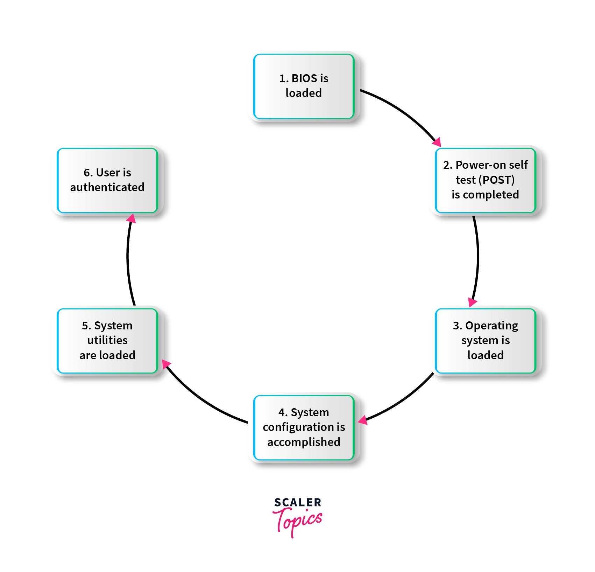
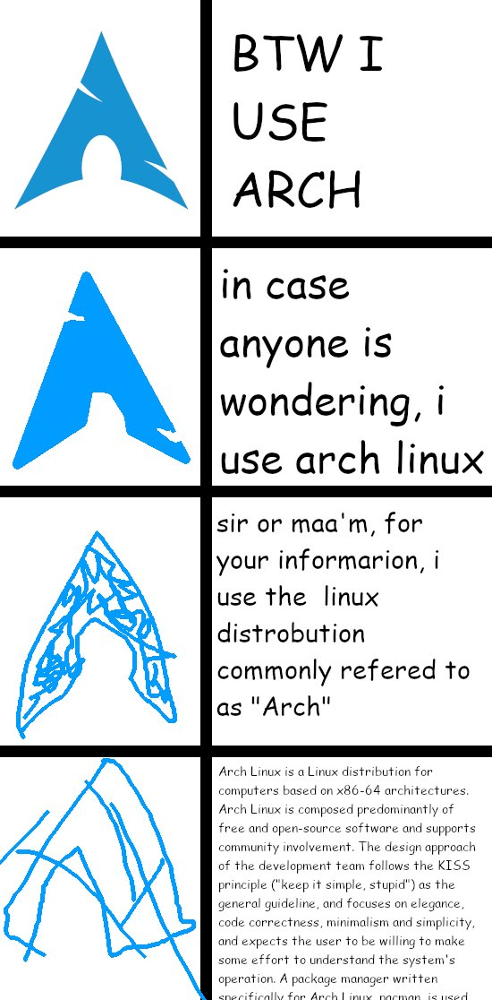

# <p align="center">TuxTide[^1]: An OS Case Study</p>
## <p align="center">Analyzing Arch Linux's Versatility from Desktop to Cloud</p>
[^1]: The title "TuxTide" (i.e. Tux Tide) represents a convergence associated with Tux, the Linux mascot. It implies a surge or wave of activity, innovation, or prominence related to Linux or open-source technology and suggests the powerful force and momentum driven by the Linux community (both developers and users), with Tux as its emblem.


<!-- Badge icons found at https://feathericons.com/ and view stats at https://yhype.me/github/accounts/Nour-MK/TuxTide/traffic -->
<p align="center">
  <a href="https://custom-icon-badges.demolab.com/badge/Project%20Status-Work%20in%20Progress-1793d1?style=for-the-badge&logo=activity&logoSource=feather&logoColor=white">
    </a>
  <a href="https://custom-icon-badges.demolab.com/badge/Word%20Count-10k-1793d1?style=for-the-badge&logo=type&logoSource=feather&logoColor=white">
    </a>
  <a href="https://custom-icon-badges.demolab.com/badge/Views%20Count-10k-1793d1?style=for-the-badge&logo=eye&logoSource=feather&logoColor=white">
    </a>
</p>

Question: *What is the strongest animal in the tech industry?*

This study aims to academically investigate operating systems, focusing on Arch Linux. It begins with an Executive Summary and Glossary to provide brief insights and clarify technical terms used throughout the study. The Introduction section outlines the criteria for selecting operating systems and presents background information on Linux and Arch Linux history. Parts 1 and 2 discuss Arch Linux's functionality as both a Daily Driver[^51] OS and a Cloud Computing OS. Additionally, Part 2 compares Arch Linux's roles in daily usage and cloud computing environments, analyzing factors such as implementation, performance, hardware support, community and support, updates and stability, as well as licensing and cost considerations. Part 3 addresses Additional Considerations, including legal and ethical issues related to operating systems and proposing potential solutions. The study concludes by giving an overview to recap all discussed findings, comparing Linux with mainstream operating systems like Windows and macOS, suggesting avenues for further research, and considering the possibility of constructing a custom Linux distribution of our own! Finally, a list of resources is provided for reference and further exploration.

[^51]: A computer or operating system that is used regularly for everyday tasks, such as web browsing, email, document editing, etc. It is the primary system relied upon by the user for their computing needs.

Linux stands as the definitive choice for system administrators, individuals striving for control over their computing environment, and scholars, like ourselves, in search of a resource-rich operating system for an extensive case study. You may explore the diverse offerings of various OSes, but you cannot outrun the penguin for long. Inevitably, all roads lead to Linux.

To view this paper in day or night theme, adjust your settings [here](https://github.com/settings/appearance). <br>
To search for a specific word, press <kbd>Ctrl+F</kbd> on Windows or <kbd>⌘+F</kbd> on macOS. 

## Work Distribution & Acknowledgements
| | Member            | ID        | Contact                                                                                        | Task |
|-|-------------------|-----------|------------------------------------------------------------------------------------------------|------|
|1| Urita Sadallah    | 2021004899| [Email](mailto:urita.sadallah@aurak.ac.ae), [Github](https://github.com/uritaaquila)         | 1. Conducted research on synchronization. <br> 2. Conducted research on deadlock. <br> 3. Prepared outstanding presentation slides. |
|2| Mohamed Abouissa  | 2021005188| [Email](mailto:mohamed.abouissa@aurak.ac.ae), [Github](https://github.com/Mohamed-Abouissa)   | 1. Conducted research on introduction. <br> 2. Conducted research on memory management. <br> 3. Conducted research on file management. |
|3| Khawla Alhammadi  | 2021004956| [Email](mailto:khawla.alhammadi@aurak.ac.ae), [Github](https://github.com/Khawlaalh)                                                  | 1. Prepared executive summary. <br> 2. Compiled a glossary in the footnotes. <br> 3. Conducted research on OS trends. |
|4| Sarah Alsuwaidi   | 2021004782| [Email](mailto:sarah.alsuwaidi@aurak.ac.ae), [Github](https://github.com/SarahAlsuwaidi)                                                   | 1. Conducted research on cloud computing OSes. <br> 2. Compared OS of Part 1 with OS of Part 2. <br> 3. Conducted research on legal and ethical issues.  |
|5| Ahmad Hammoudeh   | 2021004915| [Email](mailto:ahmad.hammoudeh@aurak.ac.ae), [Github](https://github.com/ahmaadmohd)          | 1. Provided solutions to issues identified. <br> 2. Wrote the conclusion. <br> 3. Formatted resources in APA 7th edition style. |
|6| Nour Mohamed      | 2021004938| [Email](mailto:nour.mohamed@aurak.ac.ae), [Github](https://github.com/Nour-MK)                  | 1. Conducted research on process and threads. <br> 2. Conducted research on process scheduling. <br> 3. Exported case study to various formats. |


We extend our sincere appreciation to Dr. Zubaidah Al-Hazza for her invaluable guidance, encouragement, and support throughout this research project. Her expertise and insightful feedback have significantly contributed to the completion of this study.


## Table of Contents

1. [Executive Summary](#executive-summary)
2. [Introduction](#introduction)<br>
&nbsp;<span>2.1.</span>  [Criteria for Choosing the Operating Systems in Parts 1 & 2](#criteria-for-choosing-the-operating-systems-in-parts-1--2)<br>
&nbsp;<span>2.2.</span>  [Background Information](#background-information)<br>
&nbsp;&nbsp;&nbsp;&nbsp;&nbsp;&nbsp;&nbsp;&nbsp;<span>2.2.1.</span>  [The Man & The Penguin](#the-man--the-penguin)<br>
&nbsp;&nbsp;&nbsp;&nbsp;&nbsp;&nbsp;&nbsp;&nbsp;<span>2.2.2.</span>  [Linux History](#linux-history)<br>
&nbsp;&nbsp;&nbsp;&nbsp;&nbsp;&nbsp;&nbsp;&nbsp;<span>2.2.3.</span>  [Arch Linux History](#arch-linux-history)<br>
&nbsp;&nbsp;&nbsp;&nbsp;&nbsp;&nbsp;&nbsp;&nbsp;<span>2.2.4.</span>  [Clarifying Misconceptions](#clarifying-misconceptions)<br>
3. [Part 1: Daily Driver OS (Arch Linux)](#part-1-daily-driver-os-arch-linux)<br>
&nbsp;3.1. [Processes and Threads](#processes-and-threads)<br>
&nbsp;3.2. [Process Scheduling](#process-scheduling)<br>
&nbsp;3.3. [Synchronization](#synchronization)<br>
&nbsp;3.4. [Deadlock](#deadlock)<br>
&nbsp;3.5. [Memory Management](#memory-management)<br>
&nbsp;3.6. [File Management](#file-management)<br>
4. [Part 2: Cloud Computing OS](#part-2-cloud-computing-os)<br>
&nbsp;4.1. [Trends in Operating Systems](#trends-in-operating-systems)<br>
&nbsp;4.2. [What Constitutes a Cloud Computing OS?](#what-constitutes-a-cloud-computing-os)<br>
&nbsp;&nbsp;&nbsp;&nbsp;&nbsp;&nbsp;&nbsp;&nbsp;4.2.1. [Arch Linux as a Cloud OS](#arch-linux-as-a-cloud-os)<br>
&nbsp;4.3. [Comparison with OS of Part 1](#comparison-with-os-of-part-1)<br>
&nbsp;&nbsp;&nbsp;&nbsp;&nbsp;&nbsp;&nbsp;&nbsp;4.3.1. [Implementation-wise](#implementation-wise)<br>
&nbsp;&nbsp;&nbsp;&nbsp;&nbsp;&nbsp;&nbsp;&nbsp;4.3.2. [Performance-wise](#performance-wise)<br>
&nbsp;&nbsp;&nbsp;&nbsp;&nbsp;&nbsp;&nbsp;&nbsp;4.3.3. [Hardware Support](#hardware-support)<br>
&nbsp;&nbsp;&nbsp;&nbsp;&nbsp;&nbsp;&nbsp;&nbsp;4.3.4. [Community and Support](#community-and-support)<br>
&nbsp;&nbsp;&nbsp;&nbsp;&nbsp;&nbsp;&nbsp;&nbsp;4.3.5. [Updates and Stability](#updates-and-stability)<br>
&nbsp;&nbsp;&nbsp;&nbsp;&nbsp;&nbsp;&nbsp;&nbsp;4.3.6. [Licensing and Cost](#licensing-and-cost)<br>
5. [Part 3: Additional Considerations (Best Practices in OS)](#part-3-additional-considerations-best-practices-in-os)<br>
&nbsp;5.1. [Legal and Ethical Issues](#legal-and-ethical-issues)<br>
&nbsp;5.2. [Solutions to Issues](#solutions-to-issues)<br>
6. [Conclusion](#conclusion)<br>
&nbsp;6.1. [Overview](#overview)<br>
&nbsp;6.2. [Linux vs. Our Current Daily Drivers](#linux-vs-our-current-daily-drivers)<br>
&nbsp;&nbsp;&nbsp;&nbsp;&nbsp;&nbsp;&nbsp;&nbsp;6.2.1. [Linux vs. Windows](#linux-vs-windows)<br>
&nbsp;&nbsp;&nbsp;&nbsp;&nbsp;&nbsp;&nbsp;&nbsp;6.2.2. [Linux vs. macOS](#linux-vs-macos)<br>
&nbsp;&nbsp;&nbsp;&nbsp;&nbsp;&nbsp;&nbsp;&nbsp;6.2.3. [Takeaways](#takeaways)<br>
&nbsp;6.3. [Further Research](#further-research)<br>
&nbsp;6.4. [Building Our Own Distro!](#building-our-own-distro)<br>
&nbsp;6.5. [Getting Started with Linux: Essential Tools for Navigating the Command Line](#getting-started-with-linux-essential-tools-for-navigating-the-command-line)<br>
7. [Gallery of Figures](#gallery-of-figures)<br>
8. [Resources](#resources)<br>
9. [Terms of Use](#terms-of-use)<br>

## Executive Summary


When referring to "Linux," it's essential to understand that Linux itself is not an operating system in the traditional sense. Instead, it's a kernel, which is the core component of an operating system responsible for managing hardware resources and providing essential services to other software running on the system. To create a complete operating system, the Linux kernel must be combined with various user-space utilities, libraries, and applications. These components are typically provided by various Linux distributions, which package the Linux kernel along with other software into a cohesive and usable operating system. Linux distributions, therefore, represent different collections of software built around the Linux kernel, each with its own package management system, default desktop environment, configuration tools, and software repositories. 


## Introduction
An operating system (OS) serves as the crucial intermediary between computer hardware and user applications, providing a comprehensive platform for managing and coordinating resources within a computer system. Through efficient resource management, the OS oversees CPU scheduling, memory allocation, and device access, ensuring optimal utilization and preventing conflicts. Moreover, it handles processes and threads, enabling multiple programs to run concurrently while facilitating creation, scheduling, and termination. With file system management, the OS organizes and safeguards data, offering functionalities like file operations and access controls. It presents users with various interfaces, including graphical, command-line, and programming interfaces, facilitating interaction with the system. Furthermore, modern OSes incorporate networking capabilities, security mechanisms, and error handling features to ensure seamless communication, protect against threats, and maintain system stability. Integral to device operation, the OS includes device drivers, enabling hardware components to communicate effectively with the system. Overall, the OS plays a pivotal role in enabling efficient and secure utilization of computer resources, enhancing user productivity and system reliability. Shells in an operating system serve as command interpreters, acting as an interface between users and the operating system's kernel. They provide a means for users to interact with the system by accepting commands and executing them, facilitating tasks such as launching programs, navigating directories, and managing files. The term "shell" originates from the concept of a protective outer layer or covering, similar to the outer shell of an egg or a nut. In the context of operating systems, the shell serves as the outer layer through which users interact with the underlying system. Shells are often referred to as such because they encapsulate and shield users from the complexities of the underlying operating system, providing a user-friendly interface for executing commands and accessing system resources. The Bourne shell, created in the year 1979 at Bell Labs, is the first Unix shell. It is utilized mainly for scripting functions and offers a command-based programming interface that allows users to understand and implement commands. When a user inputs a command, the shell interprets it and enables the OS to execute appropriate actions, such as task automation. Bash is a freely available alternative to the Bourne shell that is included in Linux operating systems. Although it shares similarities with the original Bourne shell, it offers additional functionalities such as the ability to edit commands on the command line. The Open-Source community holds Bash in high regard. Being included with Linux, Bash has become the most popular UNIX shell, and it can be run on different terminals, including GNOME Terminal and Konsole on Linux. By default, system directories such as /usr/bin and /bin store most commands on Linux and Unix systems. Whenever you enter a command in Bash, it checks a specific directory on the system to see if that command exists. If it does, it will execute it. Linux systems are often identified by their use of Bash, or the Bourne Again Shell. However, there are other shells that offer more functionality besides Bash. One such shell is ZSH, also known as the Z shell, which is an extended version of the Bourne Shell (sh) that has additional features and supports plugins and themes. Since ZSH is based on the same shell as Bash, it has many similar features. PowerShell is a powerful tool for automating and configuring systems that can be used across multiple platforms, including Windows, Linux, and macOS. It is especially efficient at handling structured data, such as JSON, CSV, and XML, as well as working with REST APIs and object models. PowerShell includes a command-line shell, scripting language, and cmdlet processing framework, making it a reliable and well-established tool for system administrators. Developed by Microsoft, PowerShell is an object-oriented automation engine and scripting language that simplifies administrative tasks and system configurations. Its scripting capabilities enable the creation of system management tools for commonly used processes.

### Criteria for Choosing the Operating Systems in Parts 1 & 2
Choosing an operating system (OS) for our research and case study is a critical decision that warrants careful consideration. In selecting the operating system (OS) for our study, several key criteria were considered to ensure an immersive and engaging research experience. Firstly, the OS should not be widely recognized or mainstream to avoid duplication of efforts with classmates, fostering a unique and stimulating exploration and presentation of key findings. This requirement eliminates OSes such as Windows, macOS, Ubuntu, and Android. Secondly, the OS must be fully open-source as this allows us to freely inspect the source code, providing a firsthand understanding of its underlying architecture and infrastructure. This transparency empowers us to delve deeper into the OS's mechanisms, gaining insights that may not be readily available with closed-source alternatives. Additionally, the vast community surrounding open-source OSes serves as a valuable resource. Many community members have likely encountered and addressed the same questions and challenges we will face, offering a wealth of knowledge and expertise to draw from. This collaborative ecosystem enhances our learning process, enabling us to leverage the collective wisdom and experiences of those who have traversed similar paths before us. Additionally, the chosen OS must demonstrate maturity, offering comprehensive documentation[^22] and resources for thorough research. This requirement eliminates new or incomplete OS releases like Fuchsia, dahliaOS, ChromeOS, and Rhino Linux ensuring a stable foundation for our study. Furthermore, the OS should serve as a daily driver for personal devices, capable of supporting a wide range of tasks commonly performed by average or power users. This criterion excludes toy or meme OSes as well as specialized distributions like Temple OS, Hannah Montana Linux, AmogOS, Kali Linux, BlackArch Linux, and Garuda Linux ensuring relevance and practicality in our investigation. Finally, accessibility is crucial, necessitating the availability of a virtual machine (VM) image to facilitate experimental demonstrations and testing. By adhering to these criteria, we aimed to select an OS that piques the interest of all contributors and enables us to conduct a comprehensive and meaningful study.

[^22]: Comprehensive information and instructions provided with software or hardware products, including user manuals, guides, tutorials, and technical specifications. It helps users understand and utilize the features and capabilities of the product.

#### Why Arch Linux?
Distro hopping is a term used to describe the practice of frequently switching between different Linux distributions in search of the perfect fit. This phenomenon is particularly prevalent among Linux enthusiasts who enjoy exploring the diverse range of distributions available in the Linux ecosystem. A fun realization was that even in our pursuit of studying Linux, we inadvertently found ourselves drawn into the cycle of distro hopping before settling for Arch. 

Firstly, the distinction between a distribution and an operating system (OS) can sometimes be subtle but is important to understand. An operating system is the core software that manages computer hardware and provides common services for computer programs. It acts as an intermediary between applications and the computer hardware, facilitating tasks such as memory management, process scheduling, file system management, and device control. Examples of operating systems include Linux, Windows, macOS, Unix, and various others. These are the foundational software platforms upon which other software, including distributions, can be built. A distribution, often referred to as a "distro," is a specific implementation or configuration of an operating system. It typically includes the core components of the underlying operating system (such as the Linux kernel), along with additional software packages, utilities, and configurations bundled together to create a complete and usable system. Distributions often cater to specific use cases, user preferences, or philosophies. They may vary in terms of package management systems, default desktop environments, pre-installed software, system configurations, and overall design philosophy. Examples of Linux distributions include Ubuntu, Fedora, Debian, Arch Linux, CentOS, and many others. Each distribution offers its own set of features, goals, and target audience, while still being built upon the underlying Linux kernel.

A kernel is a software component that serves as the core of an operating system (OS). It acts as an intermediary between the hardware and the software applications running on the computer. The kernel manages system resources, such as memory, CPU, and input/output devices, and provides essential services to applications, such as process management, memory management, and device drivers. While the kernel itself is a software component, it interacts closely with the hardware of the computer. A kernel can be downloaded, as it is typically distributed as part of an operating system package. Many popular operating systems, such as Linux, macOS, and Windows, provide the kernel as part of their installation packages. An operating system cannot function without a kernel. The kernel serves as the core component of the operating system, responsible for managing hardware resources, providing essential services, and facilitating communication between software applications and hardware devices. Without a kernel, the operating system lacks the essential functionality required to interact with computer hardware and execute software instructions. The Arch Linux kernel is a monolithic kernel. In a monolithic kernel, all operating system services such as process management, memory management, and device drivers run in kernel space. In other words, a monolithic kernel is one where there is no access protection between the various kernel subsystems and where public functions can be directly called between various subsystems. This architecture contrasts with microkernels, where most services run as separate processes, outside the kernel space. Monolithic kernels are known for their performance advantages but can be more complex to maintain compared to microkernels. One prominent example of the importance of the kernel is seen in the GNU project's attempt to create a free version of UNIX. In their pursuit, they developed the GNU Hurd kernel. However, Hurd faced significant challenges, including poor performance and usability issues, ultimately proving inadequate for everyday use. This underscored the critical role of the kernel in the functioning of an operating system. Subsequently, Linux emerged as a successful alternative. Developed by Linus Torvalds in 1991, Linux offered a stable, high-performance kernel that gained widespread adoption and community support. When combined with the GNU operating system's tools, Linux formed a complete operating system known as the "GNU/Linux system." Linux's success can be attributed to its continual improvement, stability, performance enhancements, and a thriving community of users and developers. The kernel of an operating system can be aptly likened to the nervous system of the human body. Just as the nervous system serves as the central control and communication hub for the body's various organs and systems, the kernel acts as the core component of the operating system, orchestrating the flow of information between hardware devices, software applications, and system resources. Similar to how the nervous system regulates bodily functions and coordinates responses to external stimuli, the kernel manages essential tasks such as memory management, process scheduling, device control, and input/output operations. Additionally, like the nervous system's role in maintaining homeostasis and ensuring the body's overall functionality, the kernel ensures the stability, reliability, and smooth operation of the computer system, thereby enabling users to interact with their devices effectively. In essence, just as the nervous system is integral to the body's functioning, the kernel is indispensable for the operation of an operating system, serving as its central nervous system. The CPU (Central Processing Unit) of a computer system can be compared to the brain of the human body. Just as the brain is responsible for processing information, making decisions, and coordinating the body's activities, the CPU is the primary component of a computer system responsible for executing instructions, performing calculations, and managing data processing tasks. Similar to how the brain controls voluntary and involuntary actions, the CPU executes instructions provided by software programs and manages the flow of data within the computer system. Additionally, like the brain's role in cognitive functions such as memory and decision-making, the CPU plays a crucial role in accessing and managing various types of memory, including RAM (Random Access Memory) and cache memory. In essence, the CPU serves as the computational powerhouse of the computer system. Neither the CPU nor the kernel "controls" the other in a hierarchical sense. Instead, they work together in tandem, with the CPU executing instructions provided by software programs under the supervision and coordination of the kernel. Interestingly enough, there have been attempts to create operating systems without traditional kernels, known as kernel-less or microkernel-based operating systems. These systems differ from traditional monolithic kernels by distributing core operating system functions across multiple processes, with only a minimal kernel providing basic services such as inter-process communication and memory management. One example of a kernel-less operating system is "L4 microkernel," which is a family of microkernels designed to be small, efficient, and secure. The L4 microkernel provides minimal functionality, while additional operating system services, such as file systems, device drivers, and networking, are implemented as separate user-space processes. Another notable example is "seL4," which is a formally verified microkernel developed by the Trustworthy Systems group at CSIRO's Data61 and the University of New South Wales in Australia. seL4 is known for its high level of security and reliability, achieved through formal verification methods. While kernel-less operating systems offer benefits such as improved security, modularity, and easier maintenance, they also present challenges such as increased complexity in system design and performance overhead due to inter-process communication.

The Linux kernel is primarily written in the C programming language, with some components also using Assembly language for low-level hardware interactions and optimizations. C is chosen for its efficiency, portability, and close-to-hardware capabilities, making it well-suited for developing an operating system kernel like Linux. Additionally, the use of C allows the Linux kernel to be easily maintained, extended, and understood by a large community of developers. The Linux kernel stands as a remarkable testament to the power of open-source development, serving as the foundational bedrock upon which a diverse array of Linux distributions (distros) thrive. At the heart of the Linux kernel's extraordinary versatility and capability lies a set of foundational characteristics that make it an ideal base for a multitude of diverse operating systems. Firstly, its modular architecture allows for unparalleled flexibility and customization. The Linux kernel is composed of numerous modules that can be dynamically loaded or unloaded, enabling developers to tailor the operating system to specific requirements without compromising its integrity. This modular design also facilitates efficient resource management and scalability, making it well-suited for a wide range of hardware environments, from embedded devices to supercomputers. Additionally, the Linux kernel is renowned for its stability, reliability, and robustness. Its rigorous development process, which involves thousands of contributors worldwide scrutinizing and improving the code, ensures that it adheres to high standards of quality and security. This stability forms the cornerstone of Linux's reputation as a dependable platform for mission-critical systems and enterprise-level applications. Furthermore, the Linux kernel boasts exceptional performance and efficiency, thanks to its optimized design and emphasis on resource utilization. Its lightweight footprint and support for preemptive multitasking enable it to efficiently manage system resources, ensuring responsive and smooth operation even under heavy workloads. Moreover, the Linux kernel is characterized by its extensive hardware support and compatibility. Its open architecture and standardized interfaces make it easy to port to a wide range of hardware platforms, enabling Linux-based operating systems to run on virtually any device imaginable. This broad compatibility extends to diverse peripherals and devices, further enhancing the versatility and applicability of Linux-based systems. Its modular, adaptable design embodies technical excellence. This flexibility fuels a flourishing ecosystem where creativity knows no bounds. Moreover, the Linux kernel's robustness and reliability underpin the stability and performance of these distros, instilling confidence in users and developers alike. The sheer diversity and ingenuity of Linux distros exemplify the boundless potential of open-source software, demonstrating how a single kernel can inspire an endless tapestry of innovation and empowerment within the technology landscape.

Linux, as a kernel, forms the foundation for a plethora of distributions tailored to diverse needs and preferences. Each distribution is a manifestation of a community's vision, ranging from everyday use to specialized applications like cybersecurity or gaming. In this landscape, Arch Linux stands out as a robust and versatile option. Although its popularity clashes with our first criteria about potential duplication or the likelihood of others selecting it for similar projects, and while alternatives like Debian or Ubuntu exist, Arch's power and flexibility cannot be overlooked. Arch Linux is often esteemed for its robustness and flexibility, setting it apart from counterparts like Ubuntu or Debian. At the heart of its potency lies a distinctive rolling release model, ensuring users have access to the latest software updates seamlessly. This contrasts with the fixed release cycles of Ubuntu and Debian, which may lag behind in incorporating cutting-edge features. Another hallmark of Arch Linux is its unparalleled customizability, empowering users to craft their systems precisely to their specifications. The Arch User Repository (AUR) further enhances this flexibility, offering a vast array of user-contributed packages to expand functionality beyond the standard repository offerings. Moreover, Arch embraces a minimalist philosophy, starting users with a command-line interface (CLI)[^25] provides a bare-bones installation that serves as a blank canvas for users to build upon. This minimalist approach not only fosters a deeper understanding of the system's intricacies but also allows for a more optimized and efficient computing experience. The comprehensive documentation and active community support surrounding Arch Linux ensures a rich research experience. The Arch Wiki and forums serve as invaluable resources for troubleshooting, in-depth learning, and sharing knowledge among users. While Arch Linux may present a steeper learning curve compared to Ubuntu or Debian, many users find the challenge rewarding, as it empowers them with a greater mastery over their computing environment. Moreover, Arch serves as a solid foundation for exploring various distributions based on it, such as BlackArch or Garuda, each offering its own spin and specialization. By delving into Arch's ecosystem and its derivatives, we can uncover nuances in performance, usability, and adaptability across different environments. And, while exploring specific distributions of Arch on their own might seem tempting, it could potentially limit the breadth of our study and hinder resource accessibility. The notion that Arch Linux is built upon the Linux kernel is intriguing, but what truly captures attention is the realization that there exist operating systems derived from Arch Linux, which in turn, is derived from the Linux kernel. This phenomenon of operating systems emerging from a derivative of another, essentially forming a "fork[^60] of a fork,"[^61] is nothing short of remarkable and deserves significant recognition. In summary, Arch Linux emerges as an ideal choice for our research endeavor. Its versatility, extensive documentation, and potential for unique exploration make it a compelling option despite the challenges it presents. Through our study, we aim to shed light on the dynamic nature of operating systems and their adaptability to diverse computing environments.

[^60]: In the context of software development and version control systems like Git, "fork" refers to creating a copy of a repository (usually another person's project) under your own GitHub account. This copy allows you to freely experiment with the project, make changes, and contribute improvements without affecting the original repository. Forking is often the first step in collaborating on open-source projects, as it enables developers to work on their changes independently before proposing them to be merged back into the original project through pull requests.

[^61]: A software project that is derived from another project, which itself was originally derived from a separate project. It represents a further divergence in the development path, typically resulting in significant differences from the original codebase.

[^25]: a text-based interface used for entering commands to communicate with a computer system. It provides users with direct access to system functions and utilities through typed commands.

The top-level folders in the Linux source tree[^50] repository are as follows:
1. **arch:** Contains architecture-specific code, with each architecture implemented in its respective sub-folder (e.g., arm, arm64, x86).
2. **block:** Houses the block subsystem code, responsible for managing block I/O operations, including creating requests, scheduling them (using various I/O schedulers), merging requests, and passing them down through the I/O stack to block device drivers.
3. **certs:** Implements support for signature checking using certificates.
4. **crypto:** Provides software implementations of various cryptography algorithms, as well as a framework for offloading such algorithms to hardware.
5. **Documentation:** Includes documentation for various subsystems, Linux kernel command-line options, descriptions of sysfs files and formats, and device tree bindings.
6. **drivers:** Contains drivers for various devices, along with the Linux driver model implementation, which abstracts drivers, devices, buses, and their connections.
7. **firmware:** Stores binary or hex firmware files used by various device drivers.
8. **fs:** Houses the Virtual Filesystem Switch (generic filesystem code) and various filesystem drivers.
9. **include:** Contains header files.
10. **init:** Holds generic initialization code that runs during boot, not specific to any architecture.
11. **ipc:** Implements various Inter Process Communication system calls such as message queues, semaphores, and shared memory.
12. **kernel:** Contains process management code (including kernel thread support, workqueues), scheduler, tracing, time management, generic IRQ code, and locking.
13. **lib:** Provides various generic functions such as sorting, checksums, compression, decompression, bitmap manipulation, etc.
14. **mm:** Houses memory management code for both physical and virtual memory, including allocators, swapping, virtual memory mapping, process address space manipulation, etc.
15. **net:** Implements various network stacks including IPv4 and IPv6, BSD socket implementation, routing, filtering, packet scheduling, and bridging.
16. **samples:** Contains various driver samples.
17. **scripts:** Contains parts of the build system, scripts for building modules, the kernel configurator (kconfig), and other utility scripts (e.g., checkpatch.pl for checking patch conformity to coding style).
18. **security:** Contains the Linux Security Module framework for extending the default security model, along with implementations for multiple security extensions such as SELinux, SMACK, AppArmor, Tomoyo, etc.
19. **sound:** Houses ALSA (Advanced Linux Sound System) and the old Linux sound framework (OSS).
20. **tools:** Provides various user-space tools for testing or interacting with Linux kernel subsystems.
21. **usr:** Supports embedding an initrd file in the kernel image.
22. **virt:** Contains the KVM (Kernel Virtual Machine) hypervisor.

[^50]: refers to the hierarchical structure or organization of source code files within a software project. It represents the collection of all source code files, directories, and subdirectories that make up the codebase of a software project. In a source tree, each directory may contain one or more source code files, along with additional resources such as configuration files, documentation, test cases, and build scripts. The directory structure is typically organized in a logical manner to facilitate navigation, maintainability, and collaboration among developers working on the project. The term "source tree" is often used interchangeably with "source code," but it specifically refers to the organization and layout of the source code files within the project directory structure. It encompasses the entire set of source code files and directories that comprise the software project, providing a visual representation of the codebase's structure and organization.

### Background Information
#### The Man & The Penguin
> Only wimps use tape backup. Real men just upload their [important stuff](https://github.com/torvalds/linux) on FTP[^2] and let the rest of the world mirror it. **— Linus Torvalds**
[^2]: stands for File Transfer Protocol. It's a standard network protocol used for transferring files between a client and a server on a computer network. FTP is commonly used for uploading files from a local computer to a server or downloading files from a server to a local computer. It's often utilized for website maintenance, software distribution, and other tasks where large files need to be transferred efficiently over a network. FTP was commonly used for file transfer before the advent of platforms like GitHub. In the early days of software development and collaboration, developers often relied on FTP to share code, upload files to servers, and distribute software packages. FTP provided a straightforward way to transfer files between computers over a network, making it suitable for collaborative projects and sharing resources. While GitHub and similar platforms offer more advanced features such as version control, issue tracking, and collaboration tools, FTP served as a foundational tool for file transfer and sharing in the pre-GitHub era.

Linux's genesis traces back to Linus Torvalds, a student at the University of Helsinki, whose dissatisfaction with MINIX, a UNIX-like system designed for the 16-bit original IBM PC, catalyzed his ambition to create an operating system optimized for his more advanced 32-bit 386-based PC. Torvalds embarked on the monumental task of crafting his own kernel to harness the capabilities of his hardware. On September 17, 1991, with minimal fanfare, Torvalds quietly released version 0.01 of the Linux kernel to a small circle of acquaintances, marking the unassuming birth of what would become one of the most influential software projects in history. The significance of Linux unfolded gradually, gaining momentum as its capabilities and advantages became apparent. Collaborating with the open-source tools from the GNU project, Linux provided a compelling alternative to proprietary UNIX systems, democratizing access to a UNIX-like environment on standard personal computers devoid of the exorbitant licensing fees associated with traditional UNIX offerings. The simplicity of its distribution mechanism, exemplified by its initial release on an FTP server, facilitated widespread experimentation and adoption among enthusiasts and developers alike. As computing technology advanced, Linux's versatility positioned it as the operating system of choice for a myriad of applications. The advent of inexpensive embedded devices capable of running full-fledged operating systems in the 2000s further bolstered Linux's prominence. Its lightweight footprint, robust stability, and low resource requirements made it an ideal choice for embedded systems across diverse industries, from consumer electronics to industrial automation. The evolution of Linux is a testament to the power of collaborative development and open-source principles. From its humble origins comprising 10,239 lines of code and 88 files, Linux has burgeoned into a sprawling ecosystem encompassing over 28 million lines of code and in 69,325 files supporting an extensive array of hardware architectures (≈30+). The collective efforts of a vast community of developers, numbering over 21,000 contributors since 2005, have propelled Linux to the forefront of modern computing. The influence of Linux transcends traditional computing paradigms, permeating into new frontiers. Derivatives such as Android, powered by a modified Linux kernel, have proliferated, powering billions of active devices worldwide. Similarly, Chrome OS, a lightweight operating system derived from Gentoo Linux, has found its niche in the realm of web-centric computing. Even corporate behemoths, once skeptical of open-source software, have embraced Linux, with Microsoft's endorsement under CEO Satya Nadella marking a paradigm shift in the industry's dynamics (contradicting previous Microsoft executives like Steve Ballmer who called Linux a "cancer"). On July 3, 2019, IBM finalized its acquisition of Red Hat for a significant sum of $34 billion. Linux's journey has been nothing short of extraordinary, culminating in its momentous landing on Mars aboard the Ingenuity helicopter as part of NASA's Perseverance rover mission in 2021. As Linux continues to evolve and adapt to the ever-changing technological landscape, its legacy as a transformative force in computing remains indelible, embodying the adage that everything big starts off small.

> Some people have told me they don't think a fat penguin really embodies the grace of Linux, which just tells me they have never seen an angry penguin charging at them in excess of 100mph. They'd be a lot more careful about what they say if they had. **— Linus Torvalds**

Why not a cheetah or a gazelle? After all, for an OS known for its incredibly fast boot time, perhaps the cheetah, the fastest land animal, would be a fitting mascot. Or, for an OS known for its responsiveness and fast context switching, the gazelle, known for its agility and quick reflexes, could be a good choice. WHY A PENGUIN? As Linux celebrates its 33rd anniversary, an intriguing anecdote emerges regarding its endearing mascot, Tux the penguin. The story of Linux's iconic mascot, Tux the penguin, is as captivating as the operating system itself. Originating from the fertile mind of Linus Torvalds, a Finnish university student, Linux emerged in 1991 as a passion project, devoid of the corporate branding common to commercial operating systems. Torvalds, enamored by penguins for their exotic yet familiar appeal, found inspiration in these creatures during a memorable encounter at an Australian zoo in 1995. It was during this time that Torvalds famously recounted being "bitten" by a penguin, an anecdote that would later become enshrined in Linux lore. Before Tux's emergence, the Linux community engaged in discussions about the ideal representation for the operating system. Various suggestions, such as sharks, foxes, eagles, and hawks, were proposed on the Linux-kernel mailing list—a forum for Linux developers. Many envisioned a symbol embodying strength, intelligence, and fierceness. However, the narrative took a delightful turn with Torvalds' fondness for penguins, inspired by his memorable encounter at the Canberra zoo. Contrary to expectations, Torvalds saw in penguins a more suitable embodiment of Linux's ethos. The quest for a suitable emblem for Linux led to the creation of Tux, conceived by Larry Ewing, who captured Torvalds' vision of a plump, non-aggressive, and contented penguin. The name "Tux" itself carries a dual significance, symbolizing both "(T)orvalds (U)ni(X)" and a playful nod to the tuxedo-like appearance of certain penguin species. With its endearing charm and whimsical appeal, Tux swiftly became synonymous with Linux, embodying the ethos of open-source collaboration and community-driven innovation. Despite its widespread acclaim, Tux was not without controversy. Some members of the Linux development community initially questioned the suitability of a "cutesy" mascot, arguing that it undermined the serious nature of the operating system. Critics, like Tony Pagano, a former teacher of corporate logo design, raised concerns that Tux's adorable visage conveyed an inaccurate impression of Linux, likening it to a toy rather than a robust computing platform. However, Torvalds remained steadfast in his conviction that Tux represented the essence of Linux—a happy, cuddly symbol devoid of corporate pretense. Unlike conventional logos fiercely guarded by legal teams, Tux's open-source nature welcomed anyone to utilize it in promoting Linux-related endeavors, free from licensing restrictions or bureaucratic red tape. This accessibility mirrored the inclusive spirit of the Linux community, where collaboration and innovation flourished unhindered by corporate constraints. In 2007, a sign appeared at the Canberra zoo, where Linus Torvalds famously encountered a penguin. This sign, commemorating the event, suggested that the original Tux might still reside within the zoo's enclosure.

#### Linux History
Linux is a popular open-source operating system, it was created by Linus Torvalds in 1991, at that time, Torvalds was a computer science student at the University of Helsinki, Finland, and started working on the Linux project as a personal enterprise. The name Linux is a combination of his name, Linus, and Unix, the operating system that inspired his projects. At that time, most operating systems were proprietary and expensive, Torvalds wanted to create an operating system that could be made freely available to anyone who wanted to use it. It initially released Linux as free software under the GNU General Public License (GPL), which means anyone can use, modify and redistribute its source code. The first versions of Linux were mainly used by technology enthusiasts and software developers, but over time it has gained popularity and is used in many different types of devices such as computers, servers, smartphones and embedded systems. Linux is considered one of the most stable, secure, and reliable operating systems and is widely used in servers, supercomputers, and enterprise environments. Today, Linux is one of the most widely used operating systems in the world, with an estimated 5.53% of all desktop computers and more than 90% of the world’s top supercomputers running on Linux, and approx. 71.85% of all mobile devices run on Android, which is Linux-based. The Linux community has grown with thousands of developers and users working to create and maintain the operating system.

The Linux operating system is a type of operating system similar to Unix and based on the Linux kernel, but the Linux kernel alone is not enough to create a complete operating system. A complete Linux system package is called a distribution, many Linux distributions are available to satisfy almost any of your computing needs, and most distributions are customized for a specific user group, such as professional users, multimedia enthusiasts, software developers, or casual home users, each custom distribution includes the necessary software packages to support specialized features, such as audio and video editing software for multimedia enthusiasts or compilers and environments, integrated development for software developers. Linux distributions are commonly categorized into three main types, each catering to distinct user preferences and needs. Firstly, there are the "Rolling Release" distributions, characterized by their continuous and incremental updates, offering users access to the latest software versions as soon as they are available. These distributions prioritize cutting-edge features and frequent updates, appealing to users who desire the latest software advancements and are comfortable with potential instability. On the other end of the spectrum are the "Fixed Release" distributions, which adhere to a scheduled release cycle, typically offering long-term support (LTS) versions with extended stability and security updates. These distributions prioritize reliability and predictability, making them suitable for production environments and users who prioritize stability over bleeding-edge features. Lastly, there are the "Specialized" distributions, which are tailored to specific use cases or target audiences, such as gaming, cybersecurity, multimedia production, or education. These distributions often come pre-configured with specialized software and tools optimized for their intended purpose, providing users with a focused and streamlined experience. Overall, these three categories encompass the diverse array of Linux distributions available, each offering unique benefits and catering to a broad spectrum of user needs and preferences. Furthermore, different Linux distributions are often divided into three main categories based on their installation medium: Live CD, Installation CD, and Network Installation. Live CDs allow users to boot directly into a fully functional Linux environment without needing to install anything on their system. They are commonly used for testing and demonstration purposes. Installation CDs, on the other hand, are used to install the Linux distribution onto a hard drive or other storage device. They typically include an installer that guides users through the installation process. Network Installation involves downloading the necessary files from the internet during the installation process. This method is useful for systems without optical drives or for users who want to ensure they have the latest software versions during installation. Each of these categories offers different advantages and is suited to different use cases, providing users with flexibility and choice when installing Linux.

The Linux architecture can be depicted as a layered structure. Starting from the bottom, these layers are hardware, kernel, shell, and applications. The lowest level of the Linux architecture is the hardware layer. This layer comprises the physical components of a computer, such as the hard drive, RAM, motherboard, CPU, network interfaces, and peripherals. These components are the tangible pieces of your system on which the rest of the architecture is built. As the core of the system, the kernel performs important low-level tasks including disk management, task scheduling, memory allocation, and peripheral operations which are fundamental to efficient mining operations and system stability, the Linux kernel is designed as a monolithic entity, integrating device drivers, file systems, system server calls, and countless other important components into a single static binary, this design choice facilitates direct and efficient execution of processes granting the kernel a high degree of control over system resources and thus ensuring strong performance and reliability. Communicating directly with the system hardware, the kernel’s role is essential in optimizing system performance and stability as it translates high-level application requirements into low-level hardware instructions ensuring that the software operates efficiently while making the best use of available resources, the kernel’s architecture not only promotes seamless interaction with hardware but also supports the system’s ability to support a variety of computing tasks from everyday desktop use to managing applications, complex computer and server environments, continuously refined and enhanced by a global community of developers the Linux kernel evolves to meet the needs of modern computing maintaining its position as the foundation of the Linux operating system known for its efficiency, stability and adaptability. Just above the kernel in the Linux hierarchy is the shell; an essential component that serves as the main interface between the user and the underlying operating system. At its core, the shell provides a user-friendly platform through which commands are issued and executed allowing users to interact with the kernel and perform a variety of tasks. Although most shell interactions occur in the command line interface (CLI), where the user enters commands for the shell to interpret, it is important to note that the shell can also display itself in a graphical user interface (GUI) providing other means of interaction. Linux offers a wide variety of shell options each offering its own set of features and syntax to meet different user preferences and requirements. Among the most widely used shells is Bourne Again Shell (bash), known for its flexibility and extensive functionality making it the default choice for many Linux distributions. Additionally, users have the option to explore alternatives such as C Shell (csh) which has a C-like syntax, and Z Shell (zsh), known for its advanced customization options and interoperability. Choosing a shell often depends on factors such as script ability ease of use and compatibility with existing workflows allowing users to tailor their Linux experience to their individual needs. At the top of the Linux architecture is the application layer which represents the software that directly engages users in their computing experience. These applications include many features, meeting the diverse needs and preferences of users from essential system utilities like file managers, text editors, and network managers to apps like web browsers and productivity tools. Although applications serve as the primary interface for user interaction, their functionality relies on transparent communication with the underlying hardware and middleware. When users interact with applications, by issuing commands to open files, for example, this process requires coordinated effort across multiple layers of the Linux architecture. The shell interprets user commands and acts as a channel through which instructions are relayed to the kernel, which, in turn, coordinates the retrieval and manipulation of data from the hardware. Ultimately, the application performs the desired action whether it's displaying a file in a text editor or displaying a web page in a browser, making it easier for users to interact with the system. This complex interaction between applications, shell, and kernel highlights the cohesive nature of the Linux ecosystem where each layer works in harmony with the other to deliver a seamless and responsive computing experience. By leveraging the capabilities of applications users can exploit the full potential of the Linux operating system opening up countless possibilities for productivity, creativity, and exploration. The Linux API, or Application Programming Interface, serves as the bridge between user applications and the Linux kernel, allowing programs to interact with the operating system's services and resources. This API encompasses a vast range of functionalities, including process management, file system operations, network communication, device access, and more. Developers leverage the Linux API through system calls, library functions, and other interfaces provided by the kernel and various user-space libraries. Understanding and utilizing the Linux API is essential for building robust, efficient, and secure applications on the Linux platform.

Linux’s rich application ecosystem allows users to tailor their computing environment to their personal needs, promoting a user experience that is smooth, dynamic, and attractive to use.

Here are some interesting facts surrounding Linux. From its inception to its widespread adoption across various devices and industries, Linux has left an indelible mark on the world of computing. These fascinating tidbits offer insights into the history, development, and unique attributes of Linux.
1. In 2000, Steve Jobs offered Linus Torvalds a job at Apple with the condition that he should cease the development of Linux. However, Torvalds refused the offer and continued to work on his project.
3. Android, the most widely used operating system globally with over 2 billion users, runs on the Linux kernel.
5. Linux is the only operating system named after its founder, Linus Torvalds.
6. Initially named "FreaX," Linux was a blend of "free," "freak," and "Unix."
8. Google, Intel, Huawei, Samsung, Red Hat, Canonical, and Facebook are among the top contributors to Linux kernel development.
9. Nine out of the top ten public cloud infrastructures rely on Linux.
10. IBM selected Linux for what is anticipated to be the world's most powerful supercomputer, Sequoia.
11. Unlike major closed-source OSes, Linux distributions generally don't track user information, ensuring better user security and privacy.

#### Arch Linux History
For our case study, we chose Arch Linux as the focus. However, to fully appreciate its meaning and context, let us embark on a journey through time. We will explore the beginnings of Linux distributions, paving the way for the emergence and development of Arch Linux. This historical context will enrich our understanding of its unique place within the broader framework of Linux development. Judd Vinet, a Canadian programmer, started developing Arch Linux in early 2001. Today, this distribution ranks as one of the major distributions shaping the Linux world today. Its first official release, Arch Linux 0.1, was released on March 11, 2002. Inspired by the elegant simplicity of Slackware, BSD, PLD Linux, and CRUX, but still disappointed because of the lack of package management at the time, Vinet built its distribution according to principles similar to these distribution principles. But going further, he also wrote a package management tool called Pacman to automatically manage the installation, removal, and upgrading of packages on Arch. At the end of 2007, Vinet ceased active participation as an Arch developer. He handed over the reins to American programmer Aaron Griffin, who led the distribution until 2020 when he resigned, and Levente Polyak, a Hungarian-born Linux developer based in Germany, took over, assuming the position of head of the Arch. One of the biggest distribution-related changes occurred between 2012 and 2013 when the traditionally used `System V init` system was replaced by `systemd`.

The name "Arch Linux" is derived from the word "arch," which means "chief" or "ruler." In the context of the Linux distribution, it reflects the philosophy of giving users more control and autonomy over their system. Arch Linux aims to provide a lightweight and flexible Linux distribution that adheres to the principles of simplicity, transparency, and user-centric design. The story behind Arch Linux starts with its founder, Judd Vinet, who created the distribution in 2002. Dissatisfied with the existing Linux distributions at the time, which he felt were either too complex or too restrictive, Vinet set out to create a distribution that would be minimalistic, yet highly customizable. He wanted to build a system that would allow users to create their own unique computing environments tailored to their specific needs and preferences. The Arch community follows the philosophy of "Keep It Simple, Stupid" (KISS), which advocates for simplicity and avoiding unnecessary complexity. This philosophy extends to every aspect of the distribution, from its minimal default installation to its rolling-release model, which ensures users have access to the latest software updates. By prioritizing clarity over clutter, the minimalistic nature of Arch Linux's default installation reduces bloat and empowers users to customize their systems according to their specific needs and preferences. By starting with a clean slate, users have the freedom to selectively install only the software and components they require, thereby avoiding the burden of unnecessary dependencies and overhead and promoting a personalized computing experience that prioritizes flexibility and control.

Several *distributions* have emerged as forks from Arch Linux, exhibiting the diversity and adaptability of the Arch ecosystem. Among the active distributions, ArchBang, ArchEX, Archman, Arch Linux 32, Arch Linux ARM, ArchStrike, ArcoLinux, Artix Linux, BlackArch Linux, Bluestar Linux, ChimeraOS, Ctlos Linux, Crystal Linux, EndeavourOS, Garuda Linux, Hyperbola, instantOS, KaOS, Manjaro Linux, MSYS2, Obarun, Parabola, PuppyRus-A, RebornOS, Snal Linux, SteamOS, SystemRescue, TeArch Linux, and UBOS continue to evolve and cater to diverse user needs. However, some distributions have become inactive, representing a historical snapshot of Arch Linux's development. These inactive distributions include Anarchy, Ninja OS, Arch Hurd, Chakra, CyberOS, TalkingArch, Arch XFerience, RaspArch, Antergos, BlueLight, BBQLinux, LinHES, MagpieOS, Netrunner Rolling, SwagArch, Alfheim Linux, Archphile, MorpheusArch, TeLiSc OS, ALOBE, ArchBox, Arch Linux WSL Edition, Aseman OS, Astian OS, Audiophile Linux, Feliz, PacBSD, Nurunner Linux, Sonar, alphaOS, Apricity OS, Arch i3Nemesis, Architect, archodi, arkOS, Arquetype CRT, DidJiX, niixarch, PacBang, VeltOS, ArBer Linux, Bridge Linux, justbrowsing, Kademar, mooOS, PoliArch, Tux Hat Linux, Arch Linux MIPS, C.H.A.O.S., Delta, devilzarch, instarch, Mesk Linux, ArchE17, Lucifer's Linux, Arch Linux PPC, ArchServer, CDN Linux, ConnochaetOS, Kahel OS, LDR, Nosonja, SadOS, San Francisco Linux, Archlive, CTKArch, LinuX-gamers, AmeOS, ArchOne, ArchPwn, Elegance, UKnow4Kids, Uzume Linux, archlive-i586, Chaox, Enlisy, Firefly Linux, Maryan Linux 2, Arch Linux Modified, FaunOS, Shift Linux, uArch, Archie, March Linux, Underground Desktop, Aegis Project, Lowarch, and Minimax.

*Garuda* Linux is a prime example of an Arch-based distribution that combines the power and flexibility of Arch Linux with user-friendly enhancements and distinctive aesthetics. Designed with performance and visual appeal in mind, Garuda Linux appeals to both novice and seasoned users by simplifying the Arch experience without sacrificing its versatility. It. It offers a variety of desktop environments, each meticulously themed and optimized to deliver a unique and instantly visually appealing experience. Garuda’s use of the Zen core to improve system responsiveness and the inclusion of the Btrfs file system for robust snapshot-based backup demonstrates Garuda’s commitment to reliability and industry-leading features. branch. Additionally, the distribution is equipped with Garuda Assistant and Garuda Gamer, intuitive tools designed respectively to streamline system management and improve the gaming experience. These user-centric innovations, combined with the underlying Arch platform, make Garuda Linux an attractive choice for those who want to explore the Arch ecosystem in a more accessible and visually engaging way.

*BlackArch Linux* presents itself as a specialized distribution based on Arch, mainly focused on security professionals and ethical hackers. It extends Arch Linux’s solid foundation by integrating a vast arsenal of tools dedicated to penetration testing, security research, and forensic analysis. With over 2800 tools available in its arsenal, BlackArch Linux is designed to provide security professionals with a comprehensive suite of utilities for vulnerability scanning, network security, and exploitation tasks. The distribution is highly modular, allowing users to install the full toolkit or choose individual packages based on their specific needs, making it as lightweight or comprehensive as needed. BlackArch can be run from a live USB drive for portability or installed on a main machine for dedicated security work, providing flexibility in deployment. The inclusion of a custom BlackArch Linux repository, alongside the main Arch repositories, ensures users have access to the latest tools and security updates. BlackArch Linux embodies the principles of Arch Linux through a rolling release model, keeping security tools up to date with the latest developments. This focus on security, combined with the inherent flexibility and power of Arch Linux, makes BlackArch an essential tool for security professionals looking for a powerful and capable platform. adapted for their work.

*Pacman* package manager is an integral part of the Arch Linux ecosystem, embodying the distribution’s philosophy of simplicity and efficiency. Designed as a command-line utility, Pacman provides Arch users with a powerful yet user-friendly interface for performing package management tasks, including installing, upgrading, configuring, and removing software. What sets Pacman apart is its speed and minimalism, taking advantage of the binary package format and easy-to-read PKGBUILD script to compile packages from source. This combination ensures that users can maintain a customized system that is simple and precise. Additionally, Pacman’s dependency resolution system is both powerful and intuitive, automatically managing package dependencies with minimal user intervention. The system architecture is built around the concept of repositories, including the official Arch repository and the user-maintained AUR (Arch User Repository), providing access to a wide variety of software. With Pacman, Arch Linux users benefit from a powerful and streamlined tool that simplifies the complexity of software management, a true reflection of Arch’s philosophy of simplicity. Being a terminal-focused distribution, Arch does not have a GUI package manager. Instead, Pacman, an internally supported command-line package manager, installs, removes, and updates software packages. It combines a simple binary package format with an easy-to-use build system. So, like APT for Debian and Ubuntu or DNF for Fedora and RHEL, installing packages in Arch is done using Pacman, which is written in the C programming language and uses the bsdtar format to package. Pacman keeps the system up to date by synchronizing the package list with the main server. This server/client model also allows users to download/install packages with one simple command, complete with all necessary dependencies. And did I mention it’s as fast as the speed of light? Going further, we can even say that Pacman is the fastest software package manager in the Linux world. In addition, Arch provides users with the Arch Build System ”ABS”, a set of scripts and configuration files for building and packaging software from source code into available ”.pkg.tar.xz” packages. settings that Pacman can handle. Arch’s ABS therefore allows users to customize and create packages based on their specific needs instead of relying on pre-compiled binaries. This provides greater flexibility and control over software installed on an Arch Linux system.

*Arch User Repository (AUR)* is a dynamic hub in the Arch Linux ecosystem, curated by the community for the community. With thousands of contributed packages, it gives Arch users many options beyond what’s available in the official repository, including options from Snap Store, Flathub, and even AppImages. Unlike the official repositories, AUR does not host predefined packages. Instead, it stores package versions called PKGBUILD, which users can use with the makepkg tool to create packages suitable for their system. These PKGBUILDs contain instructions and binaries required for installation. The journey from AUR to official deposits demonstrates its importance. Bundles often start here, gaining attention through user votes. When a package receives enough support and meets packaging standards, it is moved to a ”community” repository, provided trusted users volunteer to maintain the package. Speaking of security, while anyone can contribute to AUR, trusted users act as gatekeepers, diligently vetting submissions to minimize potential risks . However, cautious users are encouraged to review PKGBUILD before proceeding with the installation. For Arch users, AUR is a treasure trove of software capabilities, with approximately 55,000 packages and growing. Its user-focused nature embodies the philosophy of open-source collaboration, allowing anyone to contribute, adopt, or maintain packages as needed. However, accessing AUR packets requires finesse. Since Pacman does not natively support AUR packages, users often turn to AUR helper tools like YAY for streamlined installation, which is especially useful for those new to navigating the Arch Linux landscape.

No worry if you’re new to Arch Linux and prefer a GUI for managing packages instead of Pacman’s command line interface. There is a solution available: *Pacman GUI*. Developed by third-party contributors, these interfaces provide novice users with an easy and user-friendly way to navigate and control their system software. Take, for example, Pamac, a GTK3 GUI for Pacman. Designed by a skilled software engineer from the Manjaro development team, Pamac goes beyond the basic functionality of Pacman. It integrates seamlessly with Alpm, AUR, Appstream, Flatpak, and Snap, providing a complete package management experience. But Pamac isn’t your only choice. Alternatives like Octopi and tkPacman also provide great GUI alternatives for Arch users. Each offers unique features and functions, catering to a variety of user preferences and needs. It is important to note that these GUIs do not come pre-installed with Arch Linux. Instead, you will have to install them manually from the Arch User Repository (AUR) to access their benefits.

Arch Linux offers a plethora of advantages that cater to users seeking unparalleled customization and control over their computing environment. Its highly customizable nature, facilitated by a do-it-yourself (DIY) approach, allows users to create a tailored system devoid of unnecessary bloatware. The rolling release model ensures perpetual access to the latest software updates and security patches, requiring only a single installation to maintain an up-to-date system. The Pacman package manager streamlines software management with its efficiency and ease of use, while the Arch User Repository (AUR) expands software options with a vast community-maintained repository. Additionally, Arch's lightweight base system contributes to optimized performance, making it a preferred choice for those prioritizing speed and efficiency. The comprehensive documentation provided by the Arch Wiki serves as an invaluable resource, offering detailed installation guides, troubleshooting assistance, and technical insights to users at all levels.

However, Arch Linux also presents challenges that may deter less experienced users. Its steep learning curve demands a deep understanding of Linux, particularly during installation and system maintenance, which can be daunting for newcomers. The command-line-centric setup and configuration may require technical knowledge and patience, potentially alienating those accustomed to more user-friendly interfaces. Moreover, the rolling release nature of Arch entails a higher risk of system instability or failure, especially for users unfamiliar with managing such dynamic systems. Despite its vibrant community, which offers valuable support and assistance, Arch's smaller user base may pose challenges in finding immediate solutions to specific issues.

In considering Arch Linux, it's essential to recognize its target audience: enthusiasts, developers, and experienced users who value in-depth knowledge of their operating system and desire full control over their computing environment. For beginners intrigued by Arch's philosophy but cautious of its complexity, alternative Arch-based distributions like Manjaro offer a more accessible entry point. Manjaro combines a user-friendly experience with the flexibility and power of Arch, providing a smoother transition for those seeking a balance between ease of use and customization.

#### Clarifying Misconceptions
1. Unix and Linux are both operating systems with distinct origins and characteristics. Unix, developed in the late 1960s by AT&T Bell Labs, is one of the earliest operating systems. It began as a proprietary system designed primarily for mainframe[^100] computers but later adapted for various platforms. Unix follows a monolithic kernel architecture, where the kernel handles all essential operating system functions. It often adheres to standards like POSIX (Portable Operating System Interface) to ensure compatibility and portability across different Unix-like systems. Examples of Unix-based operating systems include Solaris, HP-UX, and macOS, which is based on the Unix-like FreeBSD. On the other hand, Linux, created by Linus Torvalds in 1991, is an open-source Unix-like operating system kernel. Unlike Unix, Linux's source code is freely available for modification and distribution. Linux is commonly used in conjunction with other software components to form complete operating systems, known as Linux distributions or distros. These distributions vary widely in features, user interface, package management systems, and target platforms. Linux supports various kernel architectures, including monolithic, microkernel, and hybrid designs, and many distributions adhere to POSIX standards, ensuring compatibility with Unix-like systems. While Linux is often referred to as a Unix-like operating system due to its inspiration from Unix and shared design principles, it was developed independently and not derived from Unix source code. Nonetheless, Linux systems typically provide compatibility with Unix standards and utilities, enabling them to run many programs originally written for Unix.
2. One common misconception is the role of the GNU Project in relation to Linux distributions, often referred to as GNU/Linux systems. The GNU Project, initiated by Richard Stallman in 1983, aimed to develop a free Unix-like operating system. Many essential components of Linux distributions, such as core utilities (GNU Coreutils), compilers (GCC - GNU Compiler Collection), text editors (GNU Emacs), and the GNU General Public License (GPL), are part of the GNU Project. While Linux serves as the kernel of these operating systems, the GNU Project provides crucial user-space tools and libraries to create a complete operating environment. The term "GNU/Linux" is sometimes used to highlight the role of GNU components in Linux-based systems. This distinction is important for understanding the ecosystem and philosophy behind Linux distributions.
3. Linux is often perceived as a platform exclusively tailored for expert users, neglecting its suitability for beginners. This misconception overlooks the user-friendly distributions and interface enhancements that have significantly improved Linux's accessibility to novice users. By showcasing popular distributions like Ubuntu and Linux Mint, which prioritize ease of use and intuitive interfaces, it becomes evident that Linux offers a welcoming environment for users of all skill levels.
4. Arch Linux is often misunderstood as being too complex for everyday use, primarily due to misconceptions about its installation and maintenance processes. However, Arch Linux offers simplicity through its streamlined package management system, pacman, which facilitates easy software installation and updates. Furthermore, its minimalist approach allows users to build a customized system tailored to their specific requirements. Contrary to common belief, Arch's rolling-release model ensures a seamless user experience with continuous updates and access to the latest software releases, making it a viable choice for both novice and experienced users seeking a flexible and efficient operating system.
5. A common misconception surrounding Linux is its perceived lack of software compatibility, leading some to believe that it cannot support popular applications. However, this belief overlooks the various compatibility solutions available on Linux, including compatibility layers like Wine and Proton, which enable many Windows applications and games to run seamlessly on Linux. Additionally, virtualization technologies such as VirtualBox and VMware allow users to run multiple operating systems concurrently, further expanding software compatibility. Moreover, Linux offers a rich ecosystem of alternative software applications that are native to the platform or available as cross-platform solutions, ensuring that users have access to a wide range of software options to meet their needs (e.g. LibreOffice, which provides a comprehensive suite of office productivity tools compatible with Microsoft Office file formats). Also, as Linux gains mainstream acceptance, developers increasingly prioritize compatibility with Linux for their applications. This shift is driven by the growing user base of Linux and the recognition of its importance in the software ecosystem. Finally, the availability of cross-platform development frameworks and tools facilitates the creation of applications that can run seamlessly on various different OSes including Linux.

[^100]: a high-performance computer system designed to handle large-scale computing tasks and process massive volumes of data. Mainframes are characterized by their robustness, reliability, and scalability, making them well-suited for mission-critical applications in industries such as finance, healthcare, and telecommunications.

## Part 1: Daily Driver OS (Arch Linux)

### Processes and Threads
In the domain of operating systems, processes and threads are fundamental concepts that govern the execution of programs and facilitate multitasking. Processes represent running instances of programs, each with its own memory space, resources, and execution environment. Threads, on the other hand, are lightweight execution units within a process, sharing the same memory space and resources but possessing distinct execution paths. Together, processes and threads enable concurrent execution, allowing multiple tasks to run simultaneously on a single processor or across multiple processors in a multicore system. Processes serve as the foundation of multitasking, allowing the operating system to manage multiple programs concurrently. Each process operates independently, with its own address space, file descriptors, and other resources. Processes communicate and synchronize through inter-process communication mechanisms provided by the operating system, such as pipes, sockets, and shared memory. Threads, on the other hand, provide a mechanism for concurrent execution within a process. By sharing memory and resources, threads can execute tasks simultaneously, enhancing performance and responsiveness. Threads within the same process can communicate and synchronize more efficiently than processes, as they share the same address space and can access shared data directly. The distinction between processes and threads lies in their overhead and isolation. Processes incur greater overhead due to their separate address spaces and resource allocations but offer stronger isolation and fault tolerance. Threads, on the other hand, are more lightweight and efficient, but share resources and are more susceptible to errors that can affect the entire process. Understanding processes and threads is essential for system designers and developers to create efficient and scalable software. By leveraging processes and threads effectively, operating systems can maximize resource utilization, enhance system responsiveness, and support complex multitasking environments.

A process is an operating system abstraction that groups together multiple resources: An address space, one or more threads, opened files, sockets, semaphores, shared memory regions, timers, signal handlers, and many other resources and status information. All this information is grouped in the Process Control Group (PCB). In Linux this is `struct task_struct`. A thread is the basic unit that the kernel process scheduler uses to allow applications to run the CPU. A thread has the following characteristics: Each thread has its own stack and together with the register values it determines the thread execution state, the kernel schedules threads not processes and user-level threads (e.g. fibers, coroutines, etc.) are not visible at the kernel level, and the typical thread implementation is one where the threads are implemented as a separate data structure which is then linked to the process data structure. Linux uses a different implementation for threads. The basic unit is called a task and it is used for both threads and processes. Instead of embedding resources in the task structure, it has pointers to these resources. Thus, if two threads are the same process will point to the same resource structure instance. If two threads are in different processes they will point to different resource structure instances. Linux implements the standard Unix process management APIs such as `fork()`, `exec()`, `wait()`, as well as standard POSIX threads. However, Linux processes and threads are implemented particularly differently than other kernels. There are no internal structures implementing processes or threads, instead, there is a `struct task_struct` that describes an abstract scheduling unit called task. A task has pointers to resources, such as address space, file descriptors, IPC ids, etc. The resource pointers for tasks that are part of the same process point to the same resources, while resources of tasks of different processes will point to different resources. `cgroup` is a mechanism to organize processes hierarchically and distribute system resources along the hierarchy in a controlled and configurable manner.

In Linux, a new thread or process is created with the `clone()` system call. Both the `fork()` system call and the `pthread_create()` function uses the `clone()` implementation. It allows the caller to decide what resources should be shared with the parent and which should be copied or isolated: <br>
`CLONE_FILES` // shares the file descriptor table with the parent <br>
`CLONE_VM` // shares the address space with the parent <br>
`CLONE_FS` // shares the filesystem information (root directory, current directory) with the parent <br>
`CLONE_NEWNS` // does not share the mount namespace with the parent <br>
`CLONE_NEWIPC` // does not share the IPC namespace (System V IPC objects, POSIX message queues) with the parent <br>
`CLONE_NEWNET` // does not share the networking namespaces (network interfaces, routing table) with the parent <br>
For example, if `CLONE_FILES | CLONE_VM | CLONE_FS` is used by the caller then effectively a new thread is created. If these flags are not used then a new process is created.

```c
// This is a simplified version of the do_fork function, focusing on the
// essential steps involved in process creation. The actual implementation
// in the Linux kernel source code contains additional details and error handling.

pid_t do_fork(unsigned long clone_flags,
              unsigned long stack_start,
              struct pt_regs *regs,
              unsigned long stack_size,
              int __user *parent_tidptr,
              int __user *child_tidptr,
              int trace)
{
    struct task_struct *p;
    int trace_flag = 0;
    long nr;
    pid_t pid;

    // Check if the process creation is being traced
    if (trace & CLONE_PTRACE) {
        // Set a flag for tracing
        trace_flag = PTRACE_EVENT_CLONE;
    }

    // Create a new process by cloning the current one
    nr = _do_fork(clone_flags, stack_start, stack_size,
                  parent_tidptr, child_tidptr, 0);

    // Handle errors during fork
    if (unlikely(nr < 0)) {
        // Return error code
        return nr;
    }

    // Get the process ID of the newly created process
    pid = nr;

    // Check if tracing flag is set
    if (trace_flag) {
        // Notify the tracer about the new process
        ptrace_event_pid(trace_flag, pid);
    }

    // Check if this is the child process
    if (!pid) {
        // Get the process structure of the child
        p = current;

        // Copy the register state from the parent
        copy_thread(regs, clone_flags, stack_start, stack_size);

        // Perform any necessary setup for the child process
        // (e.g., set the child's thread ID, signal handlers, etc.)

        // Wake up the parent process if it's waiting for the child
        wake_up_new_task(p);

        // Return 0 to the child process
        return 0;
    }

    // Return the process ID to the parent process
    return pid;
}
```

In the 1980s, Unix systems experienced a surge in popularity across both business and academic sectors. However, this growth was accompanied by fragmentation, with two major variants dominating the landscape: AT&T's System V and the University of California's Berkeley Software Distribution (BSD). Complicating matters further, Unix vendors often customized their systems, leading to variations like "System V with BSD enhancements." Amidst this fragmentation, the Unix community recognized the need for standardization. The Institute of Electrical and Electronics Engineers (IEEE) responded by initiating the development of a standardized operating system interface, leveraging Unix as a foundational framework. This effort culminated in the POSIX standard, formally designated as 1003, which stands for Portable Operating System Interface. Established in 1988, POSIX aimed to provide a uniform interface that would enable developers to create applications capable of running seamlessly across different Unix-like systems. At its core, POSIX embodies the principle of compatibility and interoperability. A POSIX-compliant system ensures that regardless of the underlying operating system variant, the available options and functionalities remain consistent. This standardization simplifies application development and promotes ease of migration between different Unix environments. Despite its widespread adoption and influence, it's worth noting that most Linux distributions, while closely aligned with POSIX principles, may not be officially certified as fully compliant. However, major distributions such as Red Hat Enterprise Linux (RHEL) and Ubuntu have emerged as de facto standards within the Linux ecosystem. Given the increasing importance of interoperability, future efforts may focus on further standardization to enhance compatibility among Unix-like systems. Firstly, POSIX defines standardized interfaces for process creation, management, and communication, ensuring consistency across different Unix variants. This means that developers can write code for creating and managing processes using POSIX-compliant functions, and expect it to behave similarly across different POSIX-compliant systems. Secondly, POSIX specifies interfaces for threading, which allows developers to create and manage threads in a standardized way.

### Process Scheduling
Process scheduling is a core component of operating systems that orchestrates the execution of multiple processes on a computer system's CPU (Central Processing Unit). At any given time, there are typically numerous processes competing for CPU time, and the role of the scheduler is to determine which process should execute next. The primary goal of process scheduling is to maximize system throughput, minimize response time, and ensure fair resource allocation among processes. To achieve these objectives, schedulers employ various algorithms and policies to make efficient use of CPU resources and optimize system performance. Schedulers typically operate in two main contexts: long-term scheduling and short-term scheduling. Long-term scheduling, also known as job scheduling, involves selecting processes from the pool of waiting processes and admitting them into the system for execution based on factors such as system load and resource availability. Short-term scheduling, or CPU scheduling, occurs more frequently and determines which process from the ready queue should be executed next on the CPU. CPU scheduling algorithms come in various flavors, each with its own trade-offs in terms of efficiency, fairness, and responsiveness. Some common CPU scheduling algorithms include First-Come, First-Served (FCFS), Shortest Job Next (SJN), Round Robin (RR), and Priority Scheduling. Each algorithm aims to balance the competing demands of different processes while considering factors such as process burst time, priority levels, and quantum sizes. Furthermore, modern operating systems often employ preemptive scheduling, where the scheduler can interrupt a running process and allocate CPU time to another process with higher priority or a shorter burst time. This preemptive behavior helps improve system responsiveness and ensures that no process monopolizes the CPU for an extended period.

Threads and processes are both powerful tools for concurrent and parallel execution in a Linux environment, but they have different characteristics and are suited for different types of tasks. Understanding the differences between the two, and being familiar with the thread and process management functions provided by the Linux operating system, is crucial for making the most effective use of these tools. In Linux, threads are implemented as a lightweight alternative to processes, and they are known as "lightweight processes" or "LWP". They share the same memory space as the parent process and are scheduled by the kernel, which means they can communicate with each other more easily and efficiently. This makes them well-suited for tasks that require concurrent execution, such as GUI programming, web servers, and database systems. Processes, on the other hand, are independent, self-contained execution environments, with their own memory space. Each process has its own address space, file descriptors, and other resources, which means that communication between processes is more complex and resource-intensive. Processes are typically used for tasks that do not require concurrent execution, such as batch processing and scientific simulations. In Linux, the scheduler is responsible for managing the execution of threads and processes. Processes are typically scheduled by the operating system to run on a single CPU or core, while threads are scheduled by the operating system to run on multiple CPUs or cores. Both processes and threads are scheduled by the kernel for execution, but the scheduling algorithm may treat them differently. It's also possible to use both threads and processes in a single application. The handling of processes in an Operating System like Linux is a vital topic for understanding the working of the Kernel. The logic behind scheduling processes in the system and prioritizing them in a manner that is the most optimized and efficient, while considering some trade-offs gives an insight into real-life engineering behind low-level computer stuff. A policy in scheduler functionality defines the rules governing which processes are executed when, crucially impacting system performance and responsiveness. A key consideration within policy implementation involves distinguishing between I/O-bound and processor-bound processes. Striving for an optimal mix of these types ensures efficient resource utilization. Another aspect is process priority, determining the order in which processes are scheduled for execution. Processes with higher priority typically receive more attention from the scheduler. Additionally, the concept of timeslice plays a vital role. It refers to the duration for which a process can execute before being interrupted to allow another process to run, ensuring fairness and responsiveness in multitasking environments.

In Linux, processes are categorized into two main types: real-time processes and conventional processes. Real-time processes are bound by strict response time constraints and must be executed promptly, regardless of system load. On the other hand, conventional processes do not have such strict constraints and may experience delays when the system is busy. Each process type is associated with a different scheduling algorithm, with real-time processes taking precedence over conventional ones in scheduling. The two scheduling policies for real-time processes are SCHED_RR and SCHED_FIFO, which dictate the runtime allocation and operation of the runqueue. Meanwhile, conventional processes are scheduled using the Completely Fair Scheduler (CFS) algorithm. Additionally, there are two main types of scheduling approaches: O(n) and O(1). O(n) scheduling divides the processor's time into epochs, with each task allowed to use at most one epoch. In contrast, O(1) scheduling ensures that processes are scheduled within a constant time, irrespective of the number of processes running. Dynamic priority scheduling is employed, where priorities are calculated dynamically at the time of process execution based on various factors.

In operating systems, the occurrence of a context switch is pivotal, typically instigated by a kernel transition, commonly triggered via a system call or an interrupt. During such transitions, the registers pertaining to user space are preserved on the kernel stack. Subsequently, the `schedule()` function may be invoked, signifying the need for a context switch from one thread (T0) to another (T1). Essential to implementing efficient task scheduling is the ability to block the current thread. This operation involves setting the state of the current thread to either `TASK_INTERRUPTIBLE` or `TASK_UNINTERRUPTIBLE`, adding the task to a waiting queue, invoking the scheduler to select a new task from the READY queue, and finally performing the context switch to the chosen task. Interrupts serve as pivotal events that disrupt the regular execution flow of a program, arising from either hardware devices or the CPU itself. They can be classified based on their source into synchronous (exceptions) and asynchronous (interrupts). Synchronous interrupts, or exceptions, are triggered by conditions detected by the processor while executing an instruction, such as divide by zero or system calls. Asynchronous interrupts, or interrupts, originate from external events generated by I/O devices, like network packets arriving. Most interrupts are maskable, allowing temporary postponement of their handling by disabling interrupts until re-enabled. However, there are critical interrupts, referred to as non-maskable interrupts, that cannot be disabled or postponed. Furthermore, exceptions can be further categorized into processor-detected exceptions and programmed exceptions. Processor-detected exceptions arise when an abnormal condition is detected during instruction execution, while programmed exceptions are explicitly invoked via the int n instruction. To synchronize access to shared data between interrupt handlers and other concurrent activities, controlled enabling and disabling of interrupts are often necessary. This can be achieved at various levels, including the device level, PIC level, and CPU level, through instructions like `cli` (CLear Interrupt flag) and `sti` (SeT Interrupt flag). Additionally, architectures may support interrupt priorities, permitting interrupt nesting only for interrupts with higher priority levels. After an interrupt request is generated, the processor executes a series of events culminating in running the kernel interrupt handler, followed by a prescribed sequence to resume execution post-handler execution.

A Multitasking Operating System by definition has the ability to execute multiple processes on the system simultaneously. On a single processor machine, it can give an illusion that all the processes are running simultaneously at the same time (actually the processor can focus on one process at any time, but the execution is not only the definition of the process, it is the whole thing from memory allocation and multiple processes spawning. Hence, the system seems to be having multiple processes running at the same time. A task that is marked as sleeping is also a process, it’s just the processor is busy with something else). On a multiprocessor machine, these processes are running simultaneously in parallel while some more processes are blocked or sleeping, waiting to get executed when a processor is free or the input from an external device is ready. There are two types of multitasking in operating systems: cooperative multitasking and preemptive multitasking. A very concise definition of them is that cooperative multitasking operating systems have no right to stop the process during the execution and the process has to exit on its own. On the other hand, a preemptive multitasking operating system has the right to stop the execution of the process at any time. Unix, at its core, has been implementing preemptive multitasking and Linux Kernel has been implementing preemptive multitasking (it’s obvious that if cooperative multitasking is used and a process hangs and does not exit due to any reason, it can potentially bring down the whole system). In understanding the dynamics of preemption within the kernel, we delineate between two configurations: non-preemptive and preemptive kernels. In a non-preemptive kernel setting, the kernel periodically checks whether the current process has exhausted its time slice. If so, a flag is set in interrupt context, and upon returning to userspace, the kernel assesses this flag and invokes `schedule()` if necessary. Conversely, in a preemptive kernel, the current task can be preempted even while executing in kernel mode. To manage this, special synchronization primitives like preempt_disable and preempt_enable are utilized. In preemptive kernels, preemption is automatically disabled when a spinlock is used. When a condition necessitating preemption arises, such as the expiration of a task's time slice, a flag is set. This flag is scrutinized when preemption is re-enabled, typically upon exiting a critical section through a `spin_unlock()` operation, prompting the scheduler to select a new task if required.

```c
static __always_inline struct rq *
context_switch(struct rq *rq, struct task_struct *prev,
         struct task_struct *next, struct rq_flags *rf)
{
    prepare_task_switch(rq, prev, next);
    arch_start_context_switch(prev);

    if (!next->mm) {                                // to kernel
        enter_lazy_tlb(prev->active_mm, next);

        next->active_mm = prev->active_mm;
        if (prev->mm)                           // from user
            mmgrab(prev->active_mm);
        else
            prev->active_mm = NULL;
    } else {                                        // to user
        membarrier_switch_mm(rq, prev->active_mm, next->mm);
        switch_mm_irqs_off(prev->active_mm, next->mm, next);

        if (!prev->mm) {                        // from kernel
            rq->prev_mm = prev->active_mm;
            prev->active_mm = NULL;
        }
    }

    rq->clock_update_flags &= ~(RQCF_ACT_SKIP|RQCF_REQ_SKIP);

    prepare_lock_switch(rq, next, rf);

    switch_to(prev, next, prev);
    barrier();

    return finish_task_switch(prev);
}
```

This code snippet is from the Linux kernel and represents the core functionality of a context switch, a fundamental operation in multitasking operating systems. A context switch involves switching the execution context from one process or thread (represented by `prev`) to another (represented by `next`). The function `context_switch` performs several crucial tasks to facilitate this transition. It first prepares for the task switch by calling `prepare_task_switch`, which handles any necessary setup. Then, architecture-specific operations are performed via `arch_start_context_switch`. The subsequent conditional block distinguishes between two scenarios: transitioning from kernel mode to user mode (to user) and vice versa (to kernel). If the next task is entering kernel mode, it performs lazy TLB switching and ensures proper handling of the memory management context. Conversely, if the next task is entering user mode, memory barriers are set and the memory management context is switched. Throughout this process, careful management of memory management units (MMUs) and memory contexts is crucial for maintaining system stability and security. Finally, the function concludes by preparing for locking switching, ensuring proper synchronization, and invoking the `switch_to` function to perform the actual register and stack switching. Upon completion, it returns control to the caller via `finish_task_switch`, finalizing the context switch operation. Overall, this code encapsulates the intricate mechanisms involved in transitioning between different execution contexts within the kernel, facilitating seamless multitasking in the operating system.

### Synchronization
Synchronization in operating systems is a crucial concept that ensures orderly and coordinated execution of concurrent processes or threads sharing common resources. In a multitasking environment where multiple processes or threads run simultaneously, synchronization mechanisms are essential for preventing conflicts and maintaining data integrity. At its core, synchronization involves coordinating the activities of concurrent processes to avoid problems such as race conditions, where the outcome of execution depends on the timing of events. By enforcing synchronization, operating systems enable processes to interact safely and efficiently, thereby enhancing system reliability and performance. Various synchronization mechanisms exist, each tailored to address specific challenges in concurrent programming. These mechanisms include mutual exclusion techniques like locks, semaphores, and monitors, which restrict access to shared resources, ensuring that only one process can manipulate them at a time. Additionally, synchronization primitives such as condition variables facilitate communication and coordination between processes, allowing them to signal events or wait for specific conditions to occur. Arch Linux, being a distribution of Linux, utilizes various synchronization mechanisms provided by the Linux kernel. These mechanisms include (but are not limited to):
1. **Mutexes and Semaphores:** Arch Linux uses mutexes and semaphores to control access to shared resources among processes. Mutexes allow exclusive access to a resource, while semaphores allow both exclusive and shared access based on a count. The Linux kernel provides an implementation of semaphores, which are declared and initialized using the `struct semaphore` type. Semaphores can be created directly and initialized using `void sema_init(struct semaphore *sem, int val);` where `val` is the initial value to assign to a semaphore. Another way is using helper functions and macros like `DECLARE_MUTEX(name);` and `DECLARE_MUTEX_LOCKED(name);`. In this scenario, the outcome is a semaphore variable named `name` that gets initialized to 1 via `DECLARE_MUTEX` or 0 via `DECLARE_MUTEX_LOCKED`. In the latter scenario, the mutex commences in a locked state, necessitating explicit unlocking before any thread can gain access. For cases where the mutex needs to be initialized during runtime, such as when dynamically allocated, utilize either of the functions `void init_MUTEX(struct semaphore *sem);` or `void init_MUTEX_LOCKED(struct semaphore *sem);`. Further, the `down` function decrements the value of the semaphore, while `down_interruptible` allows interruption and `down_trylock` returns immediately if the semaphore is unavailable. There are three versions of down: `void down(struct semaphore *sem);`, `int down_interruptible(struct semaphore *sem);`, and `int down_trylock(struct semaphore *sem);`. After a thread has effectively invoked one of the variants of `down`, it's considered to be "holding" the semaphore. Subsequently, that thread is granted access to the critical section guarded by the semaphore. Upon completing operations necessitating mutual exclusion, the semaphore must be relinquished. The `void up(struct semaphore *sem);` function is used to increment the value of a semaphore, effectively releasing a resource. When you call `up()` on a semaphore, it increases the semaphore count, which indicates that a resource has become available. This allows other processes or threads waiting on that semaphore to proceed, potentially accessing the shared resource it guards. Proper handling of semaphores, especially in error paths, is crucial to prevent processes from hanging and ensure system stability.
3. **Spinlocks:** are used to protect critical sections of code from simultaneous access by multiple threads. When a thread tries to acquire a spinlock that is already held by another thread, it spins in a loop until the lock becomes available. Semaphores and spinlocks are essential mechanisms in the Linux kernel for ensuring mutual exclusion. While semaphores are versatile and can handle sleeping processes, spinlocks are primarily used in non-sleeping contexts like interrupt handlers, offering higher performance. Spinlocks operate by repeatedly checking for lock availability, with atomic operations ensuring thread safety and deadlock avoidance. They are typically employed in multiprocessor systems but are also relevant for uniprocessor systems with preemptive kernels due to concurrency concerns. Proper locking mechanisms are crucial even in uniprocessor systems without preemption to prevent infinite spinning. The necessary header file for the spinlock primitives is `<linux/spinlock.h>`. A spinlock is represented by the data type `spinlock_t`. Similar to other data structures, a spinlock needs initialization. This can occur during compilation using `spinlock_t my_lock = SPIN_LOCK_UNLOCKED;` or during runtime using `void spin_lock_init(spinlock_t *lock);`. Prior to entering a critical section, the code must acquire the required lock through `void spin_lock(spinlock_t *lock);`. It's important to note that all spinlock waits are inherently uninterruptible. Once `spin_lock` is called, the code will spin until the lock becomes available. To release a previously obtained lock, use `void spin_unlock(spinlock_t *lock);`.
4. **Read-Write Locks:** Arch Linux employs read-write locks to allow concurrent read access to a resource while ensuring exclusive write access. This mechanism enhances performance by permitting multiple readers simultaneously but ensuring only one writer at a time. The Linux kernel offers a specialized semaphore type known as `rwsem`, or "reader/writer semaphore," which is occasionally beneficial in driver development. Including `<linux/rwsem.h>` is necessary for code utilizing rwsems. The relevant data structure for reader/writer semaphores is `struct rw_semaphore`, requiring explicit initialization at runtime with `void init_rwsem(struct rw_semaphore *sem);`. A freshly initialized rwsem is ready for the next task (either reader or writer). For read-only access, code interfaces with `void down_read(struct rw_semaphore *sem);`, `int down_read_trylock(struct rw_semaphore *sem);`, and `void up_read(struct rw_semaphore *sem);` such that `down_read` grants read-only access to protected resources, possibly concurrently with other readers and `down_read_trylock` returns nonzero if access was granted immediately, else 0. Success with `down_read` necessitates releasing the rwsem with `up_read`. Similarly, for writers, the functions `void down_write(struct rw_semaphore *sem);`, `int down_write_trylock(struct rw_semaphore *sem);`, `void up_write(struct rw_semaphore *sem);`, and `void downgrade_write(struct rw_semaphore *sem);` are used. These functions behave akin to their reader counterparts, providing write access. `downgrade_write` allows other readers in after performing quick changes. An `rwsem` permits either one writer or numerous readers to hold the semaphore. Writers take precedence, halting reader access until all writers conclude their tasks. This design can result in reader starvation if many writers contend for the semaphore, thus rwsems are best suited for scenarios where write access is infrequent and short-lived.
5. **Atomic Operations:** ensure that certain operations on shared data structures are performed indivisibly, without interruption. Arch Linux utilizes atomic operations extensively for synchronization purposes. Linux offers two categories of atomic operations: those involving integer variables and those focusing on individual bits within variables. Atomic operations on integer variables in C, such as `a = a + 1`, don't guarantee atomicity in the Linux kernel. To address this, Linux introduces the `atomic_t` data type to distinguish between atomic and non-atomic operations. Declaration of an `atomic_t` variable follows the format `atomic_t variable;`, indicating that this variable is intended for atomic operations only. The Linux kernel provides various functions for atomic operations on atomic variables, including:
    1. `atomic_set(atomic_t *a, int value);` // Sets the value at memory location a
    2. `atomic_add(int val, atomic_t *a);` // Adds val to the value at memory location a
    3. `atomic_read(const atomic_t *a);` // Reads the value of the atomic_t at a
    4. `atomic_inc(atomic_t *a);` // Increments the value at a atomically
    5. `atomic_dec(atomic_t *a);` // Decrements the value at a atomically
    6. `atomic_sub(int val, atomic_t *a);` // Subtracts the value at a by the amount val
6. **Lightweight PI-futexes:** Lightweight Priority Inheritance Futexes (Fast User-space Mutex) are an advanced synchronization mechanism in the Linux kernel designed for efficient user-space synchronization. Arch Linux harnesses Lightweight PI-futexes to implement sophisticated synchronization constructs within user-space applications, ensuring optimal performance and reliability. The reason we use Priority Inheritance is that implementing PI in user-space aids determinism for applications, optimizing latencies. In user-space, PI-enabled pthread mutexes work similarly to futex-based locks, with atomic operations handling locking and unlocking without kernel involvement. For the slow path, two new futex operations are introduced: `FUTEX_LOCK_PI` and `FUTEX_UNLOCK_PI`. If lock acquisition fails, `FUTEX_LOCK_PI` is invoked, initiating kernel tasks to establish a futex queue and assign a 'PI state' structure. Once acquired, the task updates the futex value and returns ownership to user-space. If unlock succeeds, no kernel operations occur. If it fails due to the `FUTEX_WAITERS` bit being set, `FUTEX_UNLOCK_PI` is called, unlocking the futex and releasing associated resources in the kernel. In Linux, PI-futexes are used to prevent priority inversion in synchronization scenarios. Priority inversion occurs when a low-priority thread holds a lock needed by a high-priority thread, causing the high-priority thread to wait unnecessarily. With PI-futexes, the priority of the holder of a lock is temporarily boosted to the priority of the waiting thread, thus preventing priority inversion. 'Robustness' and 'PI' are independent futex properties: This indicates that the properties of being "robust" (ensuring proper behavior even if a thread is terminated abruptly) and being a PI-futex are separate attributes. In other words, a futex can be either robust or PI, or it can possess both properties simultaneously, or none of them. Futexes can have the following combinations of properties: (Not robust, not PI), (Robust, not PI), (Not robust, PI), or (Robust, PI). They are called "lightweight" for three main reasons:
    1. In user-space fast paths, PI-enabled futexes require no kernel intervention or additional complexity. There are no registration or extra kernel calls; just fast atomic operations in user-space.
    2. Even in slow paths, the system call and scheduling pattern closely resemble regular futexes, maintaining efficiency.
    3. The in-kernel PI implementation simplifies around the mutex abstraction, with strict rules like single ownership and no recursive locking.

### Deadlock
Deadlock is a critical concept in operating systems, representing a scenario where two or more processes are unable to proceed because each is waiting for the other to release a resource, resulting in a deadlock. It's a situation akin to a traffic standstill, where each vehicle waits for others to move, causing a gridlock. In the realm of computing, deadlock can significantly impact system performance and reliability. At its core, deadlock arises due to the competing needs of processes for exclusive access to resources such as memory, files, or devices. When processes acquire resources but also require additional resources held by other processes, a deadlock can occur if each process retains its resources while waiting for the others to release theirs. Deadlock in operating systems stems from the simultaneous occurrence of four conditions, often referred to as the "deadly embrace." Firstly, mutual exclusion ensures that resources can only be accessed by one process at a time, preventing concurrent sharing. Secondly, the hold and wait condition arise when processes hold at least one resource while awaiting additional resources held by other processes. This waiting can potentially extend indefinitely, leading to deadlock. Thirdly, no preemption means that resources cannot be forcibly taken from processes, relying solely on voluntary release. This condition prevents breaking circular wait conditions and adds to the deadlock risk. Finally, circular wait entails a circular chain of processes, each holding a resource requested by the next process in the chain. This circular dependency creates a deadlock scenario, as each process waits indefinitely for a resource held by another, resulting in a system standstill. Regardless of the specifics, the common thread in deadlock scenarios is the circular dependency among processes, where each process is waiting for a resource held by another process. Preventing and resolving deadlocks is a critical concern in operating system design and concurrent programming. Operating systems employ various techniques to mitigate the risk of deadlock, such as resource allocation strategies, deadlock detection algorithms, and deadlock recovery mechanisms. These techniques aim to identify and break the circular wait conditions that lead to deadlock, allowing processes to resume execution and maintain system stability. Arch Linux, like other Unix-like operating systems, employs various strategies to prevent and handle deadlocks, ensuring system stability and reliability. These strategies include (but are not limited to):
1. **Resource Ordering:** Arch Linux encourages developers to adhere to a strict order when acquiring multiple resources. By consistently acquiring resources in the same predetermined order, the system reduces the likelihood of circular dependencies that can lead to deadlocks. For example, if a process requires both resource A and resource B, it should always acquire resource A before attempting to acquire resource B.
2. **Timeouts:** In scenarios where deadlocks cannot be entirely prevented, Arch Linux may implement timeout mechanisms. Threads attempting to acquire resources may be subject to a specified time limit. If a thread is unable to obtain the necessary resources within this timeframe, it releases the resources it currently holds and retries later. This approach prevents threads from indefinitely blocking due to deadlock situations, promoting system responsiveness.
3. **Deadlock Detection:** Arch Linux may utilize deadlock detection algorithms to proactively identify and resolve deadlocks. These algorithms periodically analyze the resource allocation graph to detect cycles indicative of potential deadlocks. Upon detection, the system takes appropriate measures to break the deadlock, such as releasing resources or forcibly terminating processes involved in the deadlock. By swiftly addressing deadlock conditions, Arch Linux minimizes their impact on system performance and user experience.
4. **Resource Preemption:** In critical scenarios, Arch Linux may employ resource preemption to break potential deadlocks. This involves preemptively revoking resources from processes to resolve deadlock situations. For instance, if a process holds a resource required by another process to progress, Arch Linux may forcibly reclaim the resource from the holding process, allowing the dependent process to proceed. Resource preemption ensures the timely resolution of deadlocks, preventing prolonged system stagnation and facilitating continuous operation.

### Memory Management
### File Management


## Part 2: Cloud Computing OS

### Trends in Operating Systems
As interest in operating system (OS) trends continues to grow, the technical landscape evolves to meet the demands of modern computing. Cloud operating systems are at the forefront, providing robust infrastructure and services tailored for cloud environments. These OSes offer features such as virtualization, orchestration, and automation, enabling efficient deployment and management of applications in the cloud while maximizing scalability and cost-effectiveness. Real-time operating systems (RTOS) play a critical role in applications requiring precise timing control and deterministic behavior. RTOSes prioritize tasks based on their urgency and ensure timely execution, making them indispensable in industries such as aerospace, automotive, and industrial automation, where reliability and predictability are paramount. Container operating systems optimize the deployment and operation of containerized applications. These OSes provide lightweight runtime environments for containers, leveraging technologies like Docker and Kubernetes to facilitate rapid development, deployment, and scaling of applications across diverse computing environments. Serverless operating systems abstract away infrastructure concerns, allowing developers to focus solely on writing code. By dynamically allocating resources and executing functions in response to events, these OSes enable seamless scaling and cost optimization, making them ideal for event-driven and microservices architectures. AI-powered operating systems harness the capabilities of artificial intelligence and machine learning to enhance system performance and intelligence. These OSes leverage AI techniques for tasks such as natural language processing, predictive analytics, and anomaly detection, enabling intelligent automation and decision-making across various domains. Blockchain[^3] operating systems provide the infrastructure and tools for building and managing decentralized applications (DApps) and blockchain networks. These OSes offer features such as smart contract execution, consensus mechanisms, and decentralized storage, enabling transparent and tamper-resistant applications in areas such as finance, supply chain, and identity management. Hybrid operating systems bridge the gap between on-premises and cloud environments, offering seamless integration and interoperability. These OSes enable organizations to leverage the benefits of both environments while addressing challenges such as data sovereignty, compliance, and latency, making them essential for implementing hybrid cloud strategies. Overall, these OS trends represent the ongoing evolution of computing paradigms, empowering organizations to innovate, optimize, and secure their IT infrastructures in an ever-changing technological landscape.

[^3]: is a decentralized, distributed ledger technology that enables secure and transparent recording of transactions across a network of computers. In essence, it is a digital ledger that records transactions in a series of blocks, where each block contains a cryptographic hash of the previous block, creating a chain of blocks hence the name "blockchain." Blockchain technology is perhaps most well-known for its application in cryptocurrencies like Bitcoin and Ethereum, where it serves as the underlying technology for recording and verifying transactions. However, blockchain has far-reaching implications beyond cryptocurrencies and is being increasingly adopted across various industries for applications such as supply chain management, voting systems, identity verification, smart contracts, and more.

### What Constitutes a Cloud Computing OS?
A cloud computing operating system (OS) is a specialized platform designed to facilitate the deployment, management, and operation of cloud-based applications and infrastructure. A cloud operating system (OS) must encompass several key features to effectively support modern cloud environments. Firstly, it should enable horizontal scalability, allowing resources to be dynamically provisioned and scaled to meet varying workload demands, thus optimizing resource utilization and cost efficiency. Virtualization technology is integral, abstracting hardware resources to create virtualized computing environments, facilitating the deployment and management of virtual machines (VMs) or containers on shared physical hardware. Orchestration capabilities are vital for automating tasks such as container deployment, scaling, load balancing, and service discovery. Platforms like Kubernetes or Docker Swarm streamline the management of distributed systems. Automation tools further enhance efficiency by automating routine administrative tasks and operations, including provisioning, configuration, and maintenance of cloud resources using tools like Ansible or Terraform. Multi-tenancy support enables multiple users or organizations to share the same infrastructure while maintaining isolation and security. Resilience and high availability features ensure continuous operation by incorporating fault tolerance, redundancy, failover, and disaster recovery mechanisms. Security remains paramount, with robust measures such as IAM, encryption, network security, and compliance controls safeguarding resources, data, and applications against unauthorized access and cyber threats. Overall, a cloud computing OS provides the foundational infrastructure and tools for building, deploying, and managing cloud-based applications and services efficiently and securely in dynamic and distributed computing environments.

It's a common misconception to equate cloud platforms like GCP (Google Cloud Platform), AWS (Amazon Web Services), or Azure with traditional operating systems. While these platforms do provide various services and functionalities akin to those of an operating system, they are fundamentally different in nature. Cloud platforms, such as GCP and Azure, are comprehensive environments that offer a wide range of services and tools for building, deploying, and managing applications and infrastructure in the cloud. These services encompass areas such as computing, storage, networking, databases, analytics, and more. While they may include elements that resemble aspects of an operating system, such as virtual machine instances or containerized environments, their scope extends far beyond that of a traditional operating system. Contrary to popular misconception, cloud platforms like GCP and Azure are not operating systems themselves; rather, they are built on top of underlying operating systems such as Windows Server or various Linux distributions like Red Hat CentOS. These underlying operating systems provide the foundational infrastructure and support for the cloud platform's operations. In essence, there's a succinct and accurate distinction between cloud operating systems and cloud computing platforms. Cloud operating systems primarily handle the management of hardware resources within a cloud infrastructure, offering virtualization capabilities for running applications. These are mainly utilized by cloud service providers to manage their infrastructure and provide virtual machines to users. On the other hand, cloud computing platforms offer a comprehensive environment for developing, deploying, and managing cloud-based applications. 

Another misconception is mixing up the operating system that acts as the infrastructure upon which the cloud provider is operating and the operating system that is deployed as an instance inside a virtual machine hosted on the cloud provider. The former is the underlying infrastructure OS, while the latter are guest operating systems deployed on top of it. The underlying infrastructure operating system, running directly on the physical servers and infrastructure components of cloud computing platforms, is critical for managing the hardware resources efficiently. Often, cloud providers deploy customized versions of Linux, such as distributions based on CentOS, RHEL, or Ubuntu, tailored to meet the specific needs of their infrastructure. Additionally, some cloud providers develop proprietary operating systems designed to optimize performance and scalability for their data center environments. These operating systems serve as the foundation for the cloud infrastructure, providing essential services and functionalities to support the deployment and management of virtualized resources. On the other hand, guest operating systems run within virtual machines or server instances deployed on the cloud platform. Users have the flexibility to choose the operating system that best suits their requirements, whether it's a Linux distribution like Ubuntu, CentOS, or Debian for Linux-based instances, or a Windows Server edition like Windows Server 2012, 2016, or 2019 for Windows-based instances. Cloud providers also offer specialized operating systems or custom images to cater to specific use cases or application needs. This diversity in guest operating systems enables users to create and manage virtual environments tailored to their workloads while leveraging the scalability and flexibility of cloud computing. Commonly supported operating systems for VMs include various Linux distributions such as Ubuntu, CentOS, Debian, Red Hat Enterprise Linux (RHEL), and Fedora. Additionally, Windows Server editions, encompassing versions like Windows Server 2012, 2016, and 2019, along with Windows Server Core, are frequently available choices. FreeBSD, known for its advanced networking capabilities, is also among the supported options. Moreover, container-focused operating systems like CoreOS or RancherOS, optimized for containerized workloads, are gaining popularity in cloud environments. However, when considering the OS that powers the infrastructure itself, Linux predominates. While cloud providers may not always disclose the specific OS they use for their infrastructure, Linux-based systems are widely employed due to their stability, flexibility, and open-source nature. Linux serves as the foundation for many cloud platforms, providing the scalability, reliability, and performance necessary to underpin large-scale cloud deployments. Therefore, while users have a diverse array of OS choices for their VMs, the infrastructure supporting these virtual environments often relies heavily on Linux-based systems.

#### Arch Linux as a Cloud OS

Arch Linux, specifically, known for its simplicity, flexibility, and user-centric design, can serve distinct purposes as both a personal device operating system and a cloud operating system. Arch Linux excels as a personal device operating system due to its lightweight nature and customizable architecture. Users can tailor their Arch Linux installations to meet their specific needs, whether for desktops, laptops, or other personal computing devices. Its rolling-release model ensures users have access to the latest software updates and features, while its extensive package repository provides a wide range of software choices. Arch Linux's minimalistic approach appeals to users who prefer a hands-on experience and desire full control over their system. Its user-centric philosophy empowers users to configure their environments according to their preferences, making it suitable for both novice and experienced users who appreciate a DIY approach to computing. In the domain of cloud computing, Arch Linux can be leveraged as either the OS powering the infrastructure of the cloud computing provider or the OS running in the virtual machine deployed on the cloud computing provider. Its lightweight footprint, coupled with its customizable nature, makes it well-suited for deploying and managing cloud-based workloads efficiently. 

In a cloud environment, Arch Linux can be used as the underlying operating system for virtual machines, containers, or serverless functions. Its minimalistic design allows for streamlined deployments and optimizations, reducing overhead and maximizing resource utilization. Furthermore, Arch Linux's rolling-release model ensures that cloud instances remain up-to-date with the latest security patches and software updates, enhancing overall system security and reliability. Overall, whether as a personal device OS or a cloud OS, Arch Linux offers a versatile platform that prioritizes user control, customization, and efficiency. Its adaptable nature makes it a compelling choice for a wide range of computing environments, from personal devices to cloud-based infrastructure. However, there are considerations to bear in mind when using Arch Linux as the base OS for a cloud computing platform. Its rolling-release model means that frequent updates and changes may introduce instability or compatibility issues, requiring careful management and monitoring to ensure the reliability of the cloud environment. Additionally, the DIY nature of Arch Linux may demand more extensive configuration and maintenance efforts compared to more turnkey solutions, potentially increasing the administrative overhead and complexity of managing the cloud platform. All in all, using Arch Linux as the foundational operating system for a cloud computing platform presents both opportunities and challenges. Arch Linux's lightweight design, flexibility, and customizable nature make it well-suited for specialized cloud environments where tailored configurations are desired. However, its rolling-release model and minimalistic approach may introduce complexities in managing a large-scale cloud infrastructure.

Using Arch Linux as the operating system for individual instances within a cloud environment offers both advantages and disadvantages. One advantage is its lightweight nature and minimalist design, which can lead to faster instance provisioning and lower resource consumption. Additionally, Arch Linux provides users with a high degree of control and customization, allowing them to tailor the operating system to their specific needs and preferences. However, this flexibility comes with a trade-off in terms of stability and reliability. Arch Linux follows a rolling release model, meaning that updates and changes are frequent and sometimes less thoroughly tested compared to more stable distributions. This can potentially lead to compatibility issues or unexpected system behavior, particularly in production environments where reliability is paramount. Furthermore, the lack of official support and documentation for Arch Linux in enterprise settings may pose challenges for organizations seeking robust technical assistance and long-term maintenance. Therefore, while Arch Linux can offer benefits in terms of agility and customization, organizations should carefully weigh these advantages against potential drawbacks before choosing it as the operating system for their cloud instances. Virtually, any operating system can be run on cloud infrastructure, provided that the cloud provider supports it and offers the necessary capabilities for hosting and managing the OS. Cloud providers typically offer a variety of pre-configured OS images or templates that users can choose from when provisioning virtual machines or instances. However, Arch Linux is less commonly used as an OS that powers a VM compared to other distributions like Ubuntu, CentOS, or Debian, which are more popular choices for cloud deployments due to their stability. That said, Arch Linux offers a high degree of customization and flexibility, which can be advantageous in certain cloud scenarios where specific requirements need to be met. It may be preferred by users who are comfortable with its rolling release model and desire more control over their cloud instances.

### Comparison with OS of Part 1
#### Implementation-wise
Comparing Arch Linux on a personal device to its implementation as an infrastructure cloud operating system involves evaluating their respective suitability, advantages, and considerations in different contexts. Arch Linux's utility varies significantly based on its deployment context. When installed on a personal device, it functions as the primary operating system, directly interfacing with the hardware components like CPU, RAM, and storage. This setup grants users extensive flexibility and customization options, ideal for tailoring the system to specific personal computing needs such as web browsing, multimedia consumption, software development, or gaming. However, its scalability remains constrained by the hardware limitations inherent to individual devices. Conversely, acting as an infrastructure cloud operating system, Arch Linux operates within virtual machines or containers, abstracting away the underlying hardware and leveraging the scalability and elasticity of cloud infrastructure. This setup enables dynamic resource allocation, allowing for efficient utilization and accommodating varying workload demands. Arch Linux in a cloud environment benefits from built-in features for high availability, redundancy, and fault tolerance, including distributed architectures, auto-scaling capabilities, data replication, and disaster recovery mechanisms. This robust infrastructure ensures uninterrupted service availability, surpassing the reliability typically offered by personal devices. When it comes to the graphical user interface (GUI) versus the command-line interface (CLI), Arch Linux offers distinct experiences on personal devices compared to cloud environments. On a personal device, users have the flexibility to choose between various desktop environments or window managers to create their preferred graphical environment. They can either choose to keep it pure CLI or GUI as they wish. Arch Linux's "do-it-yourself" approach allows users to customize their setup extensively, tailoring it to their specific preferences and requirements. In contrast, in a cloud environment, Arch Linux deployments typically lean towards a CLI-centric approach. Cloud instances often lack a graphical interface due to resource efficiency and security concerns. As a result, administrators interact with Arch Linux instances primarily through the command line, using SSH or remote administration tools. Arch Linux's minimalistic nature and focus on simplicity make it well-suited for command-line administration in cloud environments. Specific implementation quirks of Arch Linux on personal devices versus cloud environments stem from their distinct use cases and requirements. On personal devices, Arch Linux users may encounter challenges related to hardware compatibility, particularly with proprietary drivers or peripherals. Configuring hardware components and optimizing system performance may require manual intervention and troubleshooting. Conversely, in a cloud environment, Arch Linux instances are typically provisioned using predefined templates or images provided by the cloud provider. This simplifies the deployment process but may limit customization options compared to personal installations. Furthermore, Arch Linux on personal devices may involve more frequent user interaction for maintenance tasks such as software updates, package management, and system configuration. In contrast, Arch Linux instances in the cloud often prioritize automation and scalability, with emphasis on scripted deployments, infrastructure as code, and configuration management tools. This automated approach streamlines administration tasks and ensures consistency across multiple instances but may sacrifice some degree of individual customization available on personal devices.

#### Performance-wise
When comparing the performance of Arch Linux on a personal device to its implementation as an infrastructure cloud operating system, several factors come into play. On a personal device, Arch Linux benefits from direct access to the hardware resources, including CPU, RAM, and storage. The performance of the operating system is influenced by the specifications of the device, such as processor speed, memory capacity, and disk space. Additionally, any resource-intensive applications running concurrently may impact overall system performance. In contrast, in a cloud environment, Arch Linux instances share underlying physical hardware with other virtual machines or containers. The performance of these instances depends on the allocation of resources by the cloud provider, such as CPU cores, memory size, and disk space. The overall load on the underlying infrastructure also plays a crucial role in determining the performance of Arch Linux instances in the cloud. When deployed on a personal device, Arch Linux typically experiences minimal overhead as it directly interacts with the hardware components. However, performance may be affected by hardware limitations, such as CPU speed, memory capacity, and disk I/O speed. Additionally, system configurations and background processes running on the device can impact overall performance. On the other hand, in a cloud environment, Arch Linux instances may experience virtualization overhead, which can affect performance. While virtualization technologies have become increasingly efficient, there may still be some overhead in terms of CPU, memory, and I/O operations due to the hypervisor layer managing virtual machines or containers. The performance of network-related tasks on a personal device running Arch Linux depends on the network interface and connectivity options available. Latency may be lower compared to cloud-based deployments due to direct access to local networks and hardware resources. However, in a cloud environment, network performance can vary based on factors such as geographic location, network congestion, and the cloud provider's infrastructure. Latency may be higher compared to local deployments due to network communication over the internet and the additional hops involved in data transmission. Arch Linux running on a personal device typically utilizes local storage, such as hard disk drives (HDDs) or solid-state drives (SSDs). These storage devices offer high throughput and low latency for read and write operations, contributing to efficient system performance. However, in a cloud environment, Arch Linux instances may rely on cloud-based storage solutions, such as block storage or object storage. These storage solutions may introduce additional latency and variability in storage performance compared to local storage devices. Factors such as network latency, storage provisioning, and data replication mechanisms can affect the overall storage performance of Arch Linux instances in the cloud. Scalability on a personal device is limited to the hardware specifications of the device, and increasing performance may require hardware upgrades or replacements. However, in a cloud environment, Arch Linux instances benefit from scalability and elasticity provided by the cloud infrastructure. Cloud environments allow for dynamic allocation of resources based on demand, enabling performance to be scaled up or down as needed to accommodate changing workloads. This scalability ensures efficient resource utilization and optimal performance for Arch Linux instances in the cloud, making it suitable for handling varying levels of workload demands and traffic fluctuations.

#### Hardware Support
> I get the biggest enjoyment from the random and unexpected places. Linux on cellphones or refrigerators, just because it's so not what I envisioned it. Or on supercomputers. **— Linus Torvalds**

#### Community and Support
#### Updates and Stability
#### Licensing and Cost


## Part 3: Additional Considerations (Best Practices in OS)
Operating system (OS) hardening is a critical aspect of cybersecurity aimed at fortifying the security of operating systems like Windows, Linux, or macOS. It involves implementing a series of security measures and patches to safeguard sensitive computing systems from potential threats. This process encompasses various practices such as adhering to security best practices, ensuring secure configurations, and deploying additional security measures like firewalls and endpoint protection systems. One fundamental aspect of OS hardening is keeping the operating system updated with the latest service packs and patches, which helps mitigate vulnerabilities and reduces the risk of exploitation, including zero-day attacks. Secure configuration is another crucial component, involving tasks such as removing unnecessary programs, implementing robust access controls, and utilizing group policies to manage user privileges effectively. Additionally, deploying additional security measures like configuring firewalls, employing hardening frameworks such as AppArmor and SELinux, and implementing endpoint protection solutions are vital for enhancing OS security. Moreover, isolating sensitive data and workloads within virtual machines or containers further reduces the attack surface, limiting the potential impact of security breaches. Overall, OS hardening is essential for bolstering the security posture of computing systems and minimizing the risk of successful cyber-attacks, but it should be complemented with robust data backup processes for comprehensive protection.

### Legal and Ethical Issues
> A lot of that momentum comes from the fact that Linux is free. **— Nat Friedman**

Legal factors in the computer industry encompass laws and regulations established by governments to govern the conduct of professionals within the field. These laws, including specific acts tailored for the computer industry, serve as binding directives that all industry stakeholders must adhere to. Legal issues arise when individuals or companies contravene these laws, leading to potential repercussions such as fines, sanctions, or legal action. Compliance with legal requirements is paramount for professionals in the computer industry to ensure lawful operations and mitigate the risk of legal disputes or penalties. Legal issues in operating systems span a broad spectrum of concerns, ranging from intellectual property rights and licensing agreements to privacy regulations and antitrust laws. One significant legal consideration revolves around intellectual property, particularly concerning the ownership and licensing of operating system software. Companies invest substantial resources in developing operating systems, and protecting their intellectual property through patents, copyrights, and trademarks is essential. Legal disputes may arise if individuals or organizations infringe upon these rights through unauthorized copying, distribution, or modification of proprietary operating system code. Moreover, licensing agreements play a crucial role in governing the use of operating systems. End-user license agreements (EULAs) outline the terms and conditions under which users can legally utilize the software. Violating these agreements, such as by installing the operating system on unauthorized devices or engaging in unauthorized activities like reverse engineering, can lead to legal consequences. Additionally, open-source operating systems are subject to specific licensing requirements, such as those outlined in the GNU General Public License (GPL), which stipulates conditions for the distribution and modification of open-source software. Privacy regulations also pose legal challenges for operating systems, particularly in the context of data collection, storage, and sharing practices. Operating system providers must comply with relevant privacy laws, such as the European Union's General Data Protection Regulation (GDPR) or the California Consumer Privacy Act (CCPA), which impose strict requirements regarding user consent, data protection, and transparency in data processing activities. Failure to adhere to these regulations can result in severe penalties and reputational damage for operating system vendors. Antitrust laws represent another area of legal concern for operating system providers, especially those with dominant market positions. Companies may face antitrust scrutiny for engaging in anticompetitive practices, such as leveraging their operating system's market power to unfairly disadvantage competitors or restrict consumer choice. High-profile antitrust cases, such as the United States v. Microsoft Corporation, highlight the legal ramifications of antitrust violations in the operating system industry. Furthermore, cybersecurity and data breach incidents raise legal liability issues for operating system vendors. In the event of a security breach stemming from vulnerabilities in the operating system, companies may be held legally accountable for damages resulting from compromised user data or system disruptions. Compliance with industry standards and regulatory requirements, such as the Payment Card Industry Data Security Standard (PCI DSS) or the Health Insurance Portability and Accountability Act (HIPAA), is crucial for mitigating legal risks associated with cybersecurity breaches. In the scope of Linux operating systems, particularly focusing on Arch Linux, a myriad of legal considerations surfaces, demanding vigilance from users, developers, and distributors alike. Anchoring these concerns are the open-source licensing agreements, notably the GNU General Public License (GPL) and other Free Software Foundation (FSF) licenses, which afford users the freedom to utilize, modify, and distribute the software, while imposing obligations to maintain open-source integrity and attribute original authors. The rolling release model of Arch Linux, characterized by frequent updates and continuous evolution, underscores the need for meticulous adherence to licensing prerequisites across all incorporated software packages. Accurate documentation of licenses, dependencies, and copyright notices becomes imperative to sidestep potential legal entanglements stemming from license infringements or copyright violations. Additionally, navigating the labyrinth of software patents poses a formidable challenge, especially when integrating proprietary technologies or patented algorithms. Vigorous patent searches and legal consultations are essential to mitigate the risk of costly litigation arising from patent infringement. Privacy and data protection laws present yet another legal landscape to traverse for Arch Linux stakeholders, mandating compliance with regulations like the General Data Protection Regulation (GDPR) through robust data protection measures, transparent data processing practices, and user consent mechanisms. Upholding privacy by design principles and implementing privacy-enhancing features are crucial to preserve user data integrity and mitigate regulatory non-compliance risks.

In computer science, ethics form the moral compass guiding professional and social behavior. They encompass rules and norms that delineate right from wrong, shaping decisions and actions within the field. Ethical issues arise when choices conflict with societal values or have unintended consequences. From data privacy to algorithmic bias, navigating these challenges demands integrity, transparency, and accountability. Upholding ethical standards not only fosters trust and responsible innovation but also ensures technology serves the broader interests of society, promoting a more inclusive and ethical digital landscape. Ethical issues in operating systems encompass a multitude of concerns, reflecting the complex interplay between technological innovation, societal values, and individual rights. One prominent ethical consideration revolves around privacy, particularly concerning the collection, storage, and utilization of user data. Operating systems often gather vast amounts of personal information, ranging from browsing history to location data, raising questions about consent, transparency, and data ownership. Ethical operating systems must prioritize user privacy by implementing robust data protection measures, providing clear disclosure about data practices, and offering users meaningful control over their personal information. Furthermore, the issue of security holds significant ethical implications for operating systems. Cybersecurity vulnerabilities and exploits can result in severe consequences, including data breaches, financial losses, and compromised user safety. Ethical operating systems must prioritize security by adopting best practices for secure software development, promptly addressing vulnerabilities, and providing users with tools to enhance their digital security. Moreover, ethical considerations extend to the responsible disclosure of security vulnerabilities, ensuring that users are informed about potential risks and provided with timely patches to mitigate threats. Accessibility is another ethical dimension of operating systems that warrants attention. Ethical operating systems should strive to be inclusive and accessible to users of all abilities, accommodating diverse needs and preferences through features such as screen readers, voice recognition, and keyboard shortcuts. By prioritizing accessibility, operating systems can empower individuals with disabilities to fully participate in the digital world, fostering inclusivity and equity. Moreover, the ethical implications of proprietary versus open-source software models are worthy of consideration in the context of operating systems. Open-source operating systems promote transparency, collaboration, and community-driven innovation, aligning with ethical principles of openness and freedom. Conversely, proprietary operating systems may raise concerns about vendor lock-in, limited user control, and potential monopolistic practices. Ethical operating systems should prioritize open-source principles, enabling users to inspect, modify, and redistribute software to promote transparency, accountability, and user empowerment. Additionally, ethical considerations extend to the environmental impact of operating systems, particularly concerning energy consumption and electronic waste. Ethical operating systems should prioritize energy efficiency, resource optimization, and sustainable design practices to minimize their ecological footprint and contribute to environmental stewardship. In the scope of Linux operating systems, Arch Linux stands out for its adherence to ethical principles across various dimensions of its development and usage. At its core lies a steadfast commitment to open-source ideals, underpinned by the GNU General Public License (GPL), ensuring transparency and empowering users to inspect, modify, and redistribute software. This dedication to openness fosters collaboration and accountability within the Arch Linux community, embodying ethical values of transparency and user empowerment. Moreover, Arch Linux prioritizes user privacy by implementing robust data protection measures and providing transparent data handling practices, aligning with ethical standards such as the General Data Protection Regulation (GDPR). Accessibility is another ethical consideration, with Arch Linux striving to be inclusive by offering features that cater to users of all abilities, promoting digital inclusion and equal access to technology. Security is paramount in Arch Linux's ethical framework, with developers prioritizing the prompt resolution of vulnerabilities and fostering responsible disclosure practices to ensure the protection of users' systems and data. Additionally, Arch Linux's commitment to environmental sustainability underscores its ethical stance, as it prioritizes energy efficiency and resource optimization to minimize its ecological footprint and promote a more sustainable digital ecosystem. 

Linux, including distributions like Arch Linux, has faced its share of legal and ethical challenges over the years. Instances of concern include early disputes over potential violations of the GNU General Public License (GPL) within the Linux kernel and patent litigation threats from proprietary software companies, prompting vigilance in license compliance and legal defense. Moreover, issues surrounding package repositories have emerged, raising questions about the inclusion of improperly licensed code. While Linux development is generally open and collaborative, there have been instances of unethical behavior, such as code submissions intended to introduce security vulnerabilities or weaken encryption. Maintaining the integrity of the development process and ensuring ethical behavior among contributors is an ongoing challenge.

### Solutions to Issues


## Conclusion

### Overview
### Linux vs. Our Current Daily Drivers
This case study project has provided us with a valuable opportunity to reevaluate the choices we make regarding our operating systems and computing habits. Often, we inherit preferences from our parents or adopt mainstream trends without deeply considering what truly aligns with our individual needs and desires. This project has encouraged us to pause and reflect on the functionalities and features we genuinely value in our daily operating system interactions—whether it be Windows, MacOS, or other platforms. By delving into the history and principles behind Arch Linux, we've been prompted to reconsider the significance of simplicity, customization, and user empowerment in our computing experiences. It's prompted us to question whether the operating systems we've grown accustomed to truly serve our unique preferences and workflows, or if there are alternative options that better align with our personal values and priorities. This introspection has led us to recognize the importance of actively choosing our "daily drivers" in terms of operating systems, rather than simply defaulting to what we've always known. Moreover, this project has prompted us to reflect on the concept of "less is more" and the prevalence of bloatware[^101] on our devices, which often goes unnoticed or unexamined. We've realized that we tend to overlook the abundance of unnecessary software cluttering our systems, preferring instead to build our computing environments from the ground up where we can understand and appreciate the function of each component in contrast to prepackaged solutions where we have little control over the selection of components. In essence, true education about computer devices goes beyond mere proficiency in their use; it involves gaining a deep understanding of their underlying mechanisms and infrastructures. This knowledge not only enables individuals to utilize their devices more effectively but also empowers them to make informed decisions that maximize their potential and adaptability to evolving needs and challenges. With this in mind, we've compiled a brief comparison between Arch Linux and our personal daily driver systems: Windows (10, 11) and macOS, highlighting their features and software support. Our objective is to examine the factors driving user conversions among these platforms and Linux (all distros considered) and the obstacles preventing them from adopting Linux.

[^101]: Software that includes unnecessary features, functions, or components, often resulting in excessive resource usage, decreased performance, or decreased usability. It may be pre-installed on systems or bundled with other software packages.

#### Linux vs. Windows
> If Microsoft ever does applications for Linux it means I've won. **— Linus Torvalds**

Linux appeals to Windows users for several compelling reasons, driving their conversion to the open-source platform. Foremost, Linux's cost-free nature and freedom to modify source code provide significant cost savings and customization opportunities compared to Windows' proprietary model. Moreover, Linux's decentralized security model, coupled with its emphasis on privacy, offers users a more secure and private computing environment, free from intrusive data collection and tracking. Additionally, Linux benefits from a robust community-driven support system, providing users with valuable assistance and troubleshooting resources. Performance-wise, Linux's lightweight architecture enables it to outperform Windows, delivering superior speed and efficiency, particularly on older hardware making it a fantastic option for companies or individuals looking to prolong the life of their computers. These remarkable features collectively position Linux as an appealing alternative for Windows users seeking cost-effective, secure, customizable, and high-performing computing solutions.

For Windows users, the decision to not convert to Linux often stems from several factors. Firstly, the familiarity and widespread usage of Windows create a sense of comfort and reliability. Windows has established itself as a dominant player in the operating system market, and its compatibility with a wide range of hardware components is unparalleled. This advantage in hardware compatibility ensures that users can easily find drivers and support for their devices without much hassle. Additionally, many users are accustomed to the user-friendly interface of Windows, which offers straightforward installation processes and intuitive navigation. The prevalence of Windows in professional settings further solidifies its position, as businesses often rely on Windows-specific software and infrastructure, leading to a reluctance to transition to an unfamiliar operating system like Linux. Furthermore, Windows' seamless integration with popular applications and platforms, such as Microsoft Exchange and SharePoint, serves as a deterrent for users who depend on these tools for their daily workflows.

In recent years, Microsoft has undertaken significant efforts to embrace and collaborate with the Linux community, marking a notable departure from the historical perception of the two entities as competitors. A key initiative in this regard is Microsoft Azure, the company's cloud platform, which offers robust support for Linux-based virtual machines and services, facilitating seamless integration and interoperability with Windows-based solutions in cloud computing environments. Moreover, Microsoft has developed various tools and applications compatible with Linux systems, such as Visual Studio Code, a widely-used source-code editor, and SQL Server, a powerful database management system optimized for Linux. This commitment to cross-platform compatibility extends beyond mere application support, as Microsoft has actively contributed to the Linux kernel and open-source projects, signaling a genuine effort to foster collaboration and innovation within the Linux community. Microsoft's efforts to embrace and collaborate with the Linux community are also driven by strategic business motives aimed at capitalizing on emerging trends in the technology landscape. One key motive is to expand the reach and appeal of Microsoft's products and services by ensuring compatibility with Linux-based systems, which have gained significant traction in both enterprise and cloud computing environments. Furthermore, embracing Linux can help Microsoft mitigate potential threats to its market dominance posed by the growing popularity of open-source alternatives and ensure its continued relevance and leadership in the evolving technology landscape. Ultimately, Microsoft's efforts to sponsor Linux and engage with the open-source community are driven by strategic considerations aimed at enhancing its market position, expanding its ecosystem, and fostering innovation in the long term.

#### Linux vs. macOS
Linux's appeal to macOS users lies in its cost-effectiveness, flexibility, compatibility, vibrant developer community, customization options, and performance superiority. Unlike macOS, Linux is free and runs on a wide range of hardware, offering affordability and versatility. Its expansive compatibility extends to laptops, desktops, servers, and embedded devices, making it an attractive option for developers. Additionally, Linux's active developer community fosters creativity, rapid bug fixes, and comprehensive documentation, enhancing the user experience. Moreover, Linux's unparalleled customization capabilities empower users to tailor their systems to their preferences, a feature limited in macOS. Performance-wise, Linux is renowned for its speed and efficiency, further enticing macOS users seeking optimal system performance. These factors collectively position Linux as a compelling alternative for macOS users, emphasizing community collaboration, affordability, flexibility, and performance.

On the other hand, macOS users may find themselves hesitant to switch to Linux due to several distinct reasons. Apple's macOS ecosystem is renowned for its sleek design, intuitive user interface, and seamless integration across various Apple devices. This cohesion appeals to users seeking a consistent and polished experience throughout their digital interactions. Moreover, macOS boasts a rich software ecosystem, comprising both proprietary and open-source applications, catering to a wide range of user needs, including professional software tools like Adobe Creative Cloud and Microsoft Office. The emphasis on aesthetics and design in the macOS environment further enhances its appeal, particularly among creative professionals who value a visually pleasing workspace. Additionally, the compatibility and interoperability of macOS with other Apple products contribute to its allure, as users can effortlessly synchronize their data and workflows across multiple devices within the Apple ecosystem. These factors collectively contribute to the reluctance of macOS users to transition to Linux, as they may perceive the latter as lacking the refined user experience and software ecosystem offered by macOS.

#### Takeaways
Switching back to Windows or macOS may be influenced by various factors similar to those deterring users from converting to Linux. Reasons include the perceived effort involved, software compatibility concerns, and reliance on specific industry-standard workflows. The tight integration of Windows and macOS with their respective ecosystems, including Microsoft and Apple products and services, can incentivize users to remain within familiar environments for seamless compatibility and synchronization. Additionally, some users may impulsively switch operating systems without fully considering the potential challenges or attachment to their primary OS, leading to eventual reversion. This underscores the importance of thorough research, testing, and deliberation before making significant changes to one's computing setup.

Switching between operating systems entails adapting to different software, interfaces, and features, posing a challenge for many users. Some may not even realize the possibility of switching OSes or underestimate the effort required to learn new skills. Installing a new OS involves booting from installation media, configuring system settings, and migrating data and settings from the old system. However, difficulties arise during data migration due to concerns about loss or corruption, especially when dual booting[^70]. Additionally, incomplete hardware support and software availability in the new OS can hinder a seamless transition. Users deeply entrenched in specific ecosystems like Windows or macOS may find it daunting to break away due to proprietary hardware and software dependencies. Moreover, some users perceive no compelling reason to switch from their current OS, further complicating the transition process. Overall, the complexities of data migration, hardware compatibility, ecosystem entrenchment, and perceived necessity contribute to the challenges individuals face when attempting to switch between operating systems.

[^70]: The practice of installing and running two different operating systems on the same computer, allowing users to choose which operating system to boot into when starting the system.

Using a mix of operating systems across devices, whether through dual-booting or having different OSes on separate machines, offers users several benefits and flexibility in meeting diverse needs. Firstly, dual-booting allows individuals to leverage the strengths of each operating system for specific tasks or applications. For instance, Linux may be preferred for development or customization, while Windows or macOS could be used for productivity software or gaming. This approach maximizes efficiency and productivity by selecting the most suitable platform for each task. Additionally, maintaining separate devices with different OSes provides redundancy and mitigates the risk of downtime or compatibility issues. Users can seamlessly switch between devices based on their requirements, ensuring uninterrupted workflow and access to essential tools. Moreover, having familiarity with multiple operating systems enhances technological proficiency and adaptability, empowering users to navigate various environments with ease. 

Indeed, adopting a mixed approach to operating systems appears to offer the most balanced solution, as it allows users to harness the unique strengths of each platform without being confined to the limitations of any single OS. In a landscape where no operating system can excel at everything, opting for a combination of different systems enables individuals to achieve a comprehensive computing experience that caters to their diverse needs and preferences. In an ideal scenario where only one operating system could be utilized, an amalgamation of macOS's elegant aesthetics, Windows' widespread dominance, and Linux's unparalleled customizability and open-source ethos would emerge as the ultimate solution. By blending the sleek design and intuitive interface of macOS with the extensive software compatibility and user familiarity of Windows, users would benefit from a harmonious and efficient computing experience. Additionally, incorporating Linux's flexibility and community-driven development model would ensure unparalleled customizability and innovation. Such a unified OS would transcend individual preferences, offering a universally appealing platform that caters to a diverse range of user needs. Its combination of aesthetics, dominance, customizability, and open-source principles would create an operating system that leaves little room for contention, serving as the epitome of a comprehensive and harmonious computing environment.


### Further Research
TempleOS and Nachos represent two distinct but equally intriguing approaches to operating system development, each with its own unique characteristics and purposes. TempleOS, created by the bipolarly disordered, schizophrenic, nevertheless speculated to have an IQ level between 180-220, and recently deceased Terry A. Davis, is a singular and eccentric operating system known for its idiosyncratic design, being entirely developed by one individual, and its unconventional development environment, featuring a custom programming language called HolyC and a 640x480 resolution display. Despite its unconventional nature, TempleOS is revered by some for its technical achievements and unique perspective on computing. On the other hand, Nachos, developed at the University of California, Berkeley, is an educational operating system designed specifically for teaching operating system principles. It provides a simplified yet comprehensive framework for students to explore fundamental concepts such as process management, memory management, and file systems. While TempleOS and Nachos differ significantly in their origins and purposes, they both offer valuable insights into the inner workings of operating systems and gain valuable insights into different design paradigms, programming techniques, and system architectures. As such, further research into educational operating systems like TempleOS and Nachos can complement existing expertise in mainstream operating systems like Windows, leading to a more comprehensive understanding of computer systems and software development. The only thing deterring us from using them as the primary research subjects of this case study was their lack of technical documentation. As a result, researchers may need to rely on reverse engineering, experimental observation, or informal community resources to glean insights into these operating systems' functionality and behavior, which was decidedly unachievable given the time constraints for this study.

Future research endeavors could also involve delving into the history and technical analysis of Windows, given that it is the operating system currently at the forefront of our daily computing experience. Just as we have explored the intricacies of Linux to broaden our understanding of operating systems, a comprehensive examination of Windows would allow us to fully comprehend the tools at our disposal and leverage them to their maximum potential. Additionally, a thorough analysis of Windows would enable us to make informed decisions regarding potential OS transitions or dual-boot setups. By gaining a deep understanding of both Linux and Windows operating systems, we can weigh their respective strengths and weaknesses, considering factors such as performance, compatibility, security, and user experience. 

Currently, our research primarily revolves around conducting extensive experimentation with Arch Linux using VirtualBox software. This approach allows us to immerse ourselves in the Arch Linux environment without the need for dedicated hardware or risking changes to our existing system. Utilizing VirtualBox, we create virtual machines[^23] configured to run Arch Linux, providing a sandboxed environment where we can explore different configurations, software installations, and system optimizations. This process involves first downloading Arch's ISO image from the official website. Opening VirtualBox, we create a new virtual machine, configuring its name, type, version, and allocating resources like RAM and CPU cores. After setting up storage options, including attaching the ISO as a bootable disk, we adjust network settings to ensure connectivity. Starting the VM, Arch Linux boots from the ISO, presenting the installation environment. Following the official guide, we partition the virtual disk, format partitions, and install the base system using Pacman. Critical system configurations, such as hostname and locale, are also set up. We then install a bootloader for boot management, ensuring proper system startup. Exiting the installer, we reboot the VM into the freshly installed Arch Linux. Throughout, meticulous documentation aids in understanding configurations' impact. This hands-on approach not only familiarizes us with Arch Linux but facilitates comprehension and experimentation. While our focus remains on the virtualization of the OS, it's essential to delve into another critical term: "bare metal." Running an OS bare metal refers to running it directly on hardware without any intervening software layers or virtualization. It signifies a pure and unadulterated computing experience, where the operating system interacts directly with the underlying hardware components. This approach is often favored by enthusiasts and power users seeking maximum performance and control over their systems. 

[^23]: A software-based emulation of a physical computer system that allows multiple operating systems to run simultaneously on the same hardware. It provides isolation and encapsulation of resources, enabling efficient utilization of hardware resources.

<!-- Video added by drag and drop -->
https://github.com/Nour-MK/AURAK-CSCI-312-TuxTide/assets/123479685/9ec03109-b512-405a-93c7-b327cfbe0d1f

### Building Our Own Distro!
Before delving into the technical and theoretical aspects of constructing our own Linux distribution, it's essential to understand what it takes to build any operating system. A fascinating question to start with would be how the first OS was developed without an OS! The development of the first operating systems was indeed an inspiring endeavor, and it involved a different approach compared to modern practices. In the earliest days of computing, programmers interacted directly with the hardware, writing code that directly controlled the machine's operations. These early systems lacked what we now consider as an operating system in the modern sense. Instead, the concept of an operating system gradually emerged as a solution to manage and simplify the interaction between users, applications, and hardware. The development of the first operating system was driven by the need to manage computer hardware directly and execute programs more efficiently, a leap from the early days when developers interacted with hardware using only machine code and assembly language. Before the advent of high-level operating systems in the 1950s, computers, including models like the IBM 704 mainframe used by General Motors, did not boot up with an OS but were manually programmed for each new task. For example, early programmers would write code to control input/output devices, manage memory, and handle basic system functions. This process was complex, tedious, and error-prone, often involving a direct manipulation of ones and zeros. And, as the complexity of computing systems grew, the need for a more organized and standardized approach became apparent. The concept of an operating system began to take shape as programmers developed libraries of reusable code to perform common tasks. Over time, these libraries evolved into more sophisticated systems that provided a layer of abstraction between applications and hardware. This abstraction allowed programmers to write software that could run on different hardware platforms without significant modifications. One of the earliest examples of an operating system is the GM-NAA I/O system, developed for the IBM 7090 mainframe computer in the late 1950s. It provided a standardized interface for input/output operations, allowing programmers to write applications without needing to understand the intricacies of the underlying hardware.

Before the invention of operating systems, computers operated without any underlying software layer to manage hardware, relying heavily on manual methods such as punch cards and front panel switches. This process was not only cumbersome and error-prone but also inefficient, as each program had to include routines to manage all the hardware components it utilized. Operating directly with the hardware, users, and programmers often started from scratch for each task, configuring and connecting the machine manually using plugboards or switches to perform specific operations. This labor-intensive approach lacked flexibility, leading to the development of operating systems to streamline computing practices. Developing an operating system from scratch demands a deep dive into computer architecture and fundamental operating systems concepts. Understanding CPU behavior, memory management, and I/O operations lays the groundwork. As a developer, setting up a robust development environment with essential tools like compilers, assemblers, and emulators is paramount. Starting with a simple bootloader initiates system initialization and OS loading. Crafting a foundational kernel to manage low-level tasks and memory operations follows suit. Developing device drivers to interface with hardware components is essential for system functionality. Implementing system calls facilitates user-kernel interactions while designing a user interface enhances usability. Utility programs such as shells and file management tools further enrich the OS. Rigorous testing, debugging, and comprehensive documentation ensure the system's reliability and maintainability for future development endeavors.

Building a Linux distribution involves several intricate steps. Begin by selecting a base distribution like Ubuntu or Debian. Set up a development environment with necessary tools like compilers and package managers. Customize the kernel to suit specific requirements, modifying settings and adding drivers if necessary. Configure the bootloader, typically GRUB or LILO, ensuring compatibility with hardware. Define the filesystem structure, organizing directories and permissions according to Linux standards. Create essential system files like /etc/passwd and /etc/fstab, specifying user accounts and filesystems. Develop or integrate package management tools like dpkg or RPM to manage software installations and updates. Customize the user interface by selecting a desktop environment like GNOME or KDE, or develop a custom one if preferred. Implement system services and daemons to handle tasks like networking, printing, and logging. Secure the distribution by configuring firewalls, setting up user permissions, and enabling encryption if necessary. Thoroughly document the distribution's setup and configuration processes to aid users and developers. Test the distribution extensively in various environments to ensure stability and compatibility. Package the distribution into installable images, supporting various formats like ISO or USB, and distribute it through mirrors or repositories. Document the build process meticulously, including dependencies and build scripts, to facilitate future development and maintenance. Regularly update and maintain the distribution to address security vulnerabilities and provide new features and improvements. When discussing Linux distributions like Arch, the term "vanilla" often arises to describe the default or unmodified version of the software. In the context of Arch Linux, the vanilla installation refers to the base system as provided by the official Arch repositories, without any additional software packages or customizations. This vanilla installation serves as a clean slate for users to tailor their Linux environment according to their preferences and requirements. By starting with a vanilla Arch installation, users have the flexibility to add only the software they need, avoiding bloat and maintaining a streamlined system. Ricing, a term coined within the Linux and Unix communities, refers to the art of meticulously customizing and refining the visual appearance and functionality of a desktop environment or window manager. It's a deeply personal endeavor, akin to interior decorating or fashion design, where users aim to create a desktop environment that reflects their personality, preferences, and workflow. At its core, ricing involves tweaking every aspect of the graphical interface, from window borders and title bars to desktop icons and widgets. Users often start by selecting a window manager or desktop environment that aligns with their workflow and aesthetic preferences. Popular choices include lightweight window managers like i3, which offer tiling window management and extensive keyboard shortcuts for efficient multitasking, or full-fledged desktop environments like GNOME or KDE, which provide more features and customization options out of the box. Once a base environment is chosen, ricing enthusiasts dive into the world of themes and customization tools. Themes dictate the overall look and feel of the desktop, encompassing elements like window decorations, icons, cursors, and system fonts. Users can select pre-made themes from online repositories or create their own from scratch using tools like CSS for GTK themes or SVG for icon sets. However, ricing is not just about aesthetics; it's also about optimizing productivity and workflow. Many ricing enthusiasts prioritize functionality alongside form, crafting desktop environments that are not only beautiful but also efficient and ergonomic. This might involve customizing keyboard shortcuts, setting up custom scripts for automation tasks, or integrating third-party applications for enhanced functionality. Building a customized Linux distribution offers a myriad of possibilities for tailoring every aspect of the user experience. Beginning with the shell, users can choose from a variety of options such as Bash, Zsh, Fish, or even more exotic choices like Oil Shell, each offering unique features and customization options. Terminal customization extends this further, allowing users to modify colors, fonts, and behavior through tools like tmux or GNU Screen, enhancing productivity and aesthetics alike. Moving beyond the desktop environment, customization options abound in file managers like Thunar, Nautilus, or Ranger, where users can tweak layouts, keyboard shortcuts, and even integrate custom scripts for enhanced file management workflows. Text editors present another avenue for personalization, with powerhouses like Vim and Emacs offering vast plugin ecosystems and configuration options for tailored editing experiences. Fonts play a crucial role in visual comfort and style, with Linux providing access to a vast array of typefaces through packages like Google Fonts or custom font configurations. Extensions offer a way to extend the functionality of desktop environments like GNOME[^5] or KDE[^6], adding features ranging from weather widgets to system monitors and beyond. Users can mix and match extensions to create bespoke desktop experiences that suit their workflow and preferences perfectly. Icons and themes further refine the visual identity of the system, with icon sets like Papirus or Numix and GTK themes like Arc or Adapta providing a cohesive look across applications. Dotfiles in Linux refer to configuration files that begin with a dot (.) and are typically located in the user's home directory. These files are often hidden from regular directory listings by default. Dotfiles store settings and preferences for various applications and utilities, allowing users to customize their environment to suit their preferences. Dotfiles are closely related to the concept of "ricing" in the context of Linux and other Unix-like operating systems as it refers to the process of customizing the appearance and functionality of the user interface, often with a focus on improving aesthetics and efficiency. Dotfiles play a crucial role in ricing because they contain configuration settings for various software and utilities that can be tweaked and customized to achieve the desired look and behavior. Ricers often share their dotfiles, along with screenshots or videos showcasing their customized desktop environments, as a way to inspire others and share tips and tricks for achieving similar results. By sharing dotfiles, ricers contribute to a culture of experimentation and creativity within the Linux community, encouraging others to explore and customize their own setups. Some of the most commonly customized dotfiles include `.bashrc` for configuring the Bash shell, `.vimrc` for customizing the Vim text editor, `.gitconfig` for setting up Git preferences, and `.Xresources` for configuring X Window System resources. Additionally, users may have dotfiles for applications like the terminal emulator `(~/.config/termite/config)`, the window manager `(~/.config/i3/config)`, or the status bar `(~/.config/polybar/config)`. Beyond these core elements, every aspect of a Linux distribution can be customized to fit the user's needs, from the choice of system services and daemons to the selection of pre-installed software packages. The modular nature of Linux enables users to strip away unnecessary components, streamline performance, and create tailored distributions optimized for specific tasks or hardware configurations. Whether it's tweaking kernel parameters for performance optimization, fine-tuning audio settings for pristine sound quality, or configuring network services for optimal security, the possibilities for customization are virtually limitless, limited only by the user's imagination and technical expertise.

[^5]: is a free and open-source desktop environment for Unix-like operating systems, known for its intuitive and customizable interface. It provides essential components such as a graphical shell, window manager, file manager, and core applications like a web browser and office suite. With features like a taskbar, application launcher, and system tray, GNOME offers efficient navigation and workspace management. It prioritizes accessibility, internationalization, and adherence to open standards, aiming to create an inclusive and enjoyable computing experience for users worldwide.

[^6]: short for the K Desktop Environment, is an open-source desktop environment for Unix-like operating systems, offering a comprehensive suite of applications and tools for users. It provides a visually appealing and highly customizable interface, with features such as a taskbar, application launcher, and virtual desktops. KDE emphasizes modularity and extensibility, allowing users to tailor their desktop experience to their preferences. It includes a wide range of applications covering areas such as productivity, multimedia, education, and system utilities.

<p align="center">
    
    
</p>

<p align="center">
    
      
</p>

Linux From Scratch (LFS) is a project that provides users with step-by-step instructions for building a Linux system entirely from source code. While LFS may not directly facilitate the creation of a fully-fledged Linux distribution, it offers invaluable insights and skills that can be applied to such an endeavor. First and foremost, LFS teaches users about the inner workings of the Linux operating system. By guiding users through the process of manually compiling and configuring each component of the system—from the kernel to the shell to the various system utilities—LFS offers a deep understanding of how Linux systems are put together. Additionally, LFS teaches users about the principles of system design and architecture. Throughout the LFS process, users make numerous decisions about which components to include in their system, how to configure them, and how they interact with one another. These decisions require careful consideration of factors such as performance, compatibility, and security, all of which are critical considerations when designing a custom Linux distribution. Furthermore, LFS instills important skills in system administration and troubleshooting. Building a Linux system from scratch is a complex and error-prone process, and users will inevitably encounter challenges along the way. Whether it's resolving dependency issues, diagnosing compile errors, or troubleshooting system crashes, LFS teaches users how to effectively identify and address problems that arise during the build process. These skills are invaluable for anyone involved in the development of a Linux distribution, where the ability to debug and resolve issues quickly is essential. However, despite its educational value, it's important to recognize that building a custom Linux distribution is no small feat, and LFS is just the beginning of the journey. Creating a fully-functional distribution requires much more than simply following a set of instructions—it demands careful planning, extensive testing, and ongoing maintenance. From selecting and integrating software packages to designing the user interface to establishing a package management system, there are countless decisions to be made and challenges to overcome. 

### Getting Started with Linux: Essential Tools for Navigating the Command Line
> The penguins are clapping. They have waited their whole lives for your arrival.

For newcomers to the Linux environment, the command-line interface can initially appear daunting, akin to staring into an abyss of blackness. Understandably, many opt for the comfort of a graphical user interface (GUI)[^24] whenever possible, finding it more intuitive and user-friendly. However, familiarity with the command line can be empowering and essential, particularly in scenarios where GUIs fail or when performing system maintenance tasks. One fundamental command every Linux user should grasp is `sudo`. This command, short for "superuser do," grants elevated privileges necessary for executing tasks such as system updates or modifying critical configuration files. However, wielding `sudo` demands caution, as it bestows considerable power. Users are often greeted with a reminder upon its first use, emphasizing the need for responsibility and prudence. Package management is another crucial skill, facilitated by tools like `yum`, `apt`, or `pacman`, depending on the Linux distribution. These commands, typically preceded by `sudo`, enable users to install, remove, or update software packages effortlessly. Familiarity with these package managers is paramount for maintaining a healthy and functional system. Additionally, understanding `systemctl`, a command associated with the `systemd` service manager, is essential for managing background services. Whether starting, stopping, or enabling services to run at boot time, `systemctl` provides granular control over system processes, streamlining system administration tasks. The humble `ls` command, although seemingly basic, is a powerful tool for navigating the filesystem and inspecting directory contents. With various options available, such as `-l` to display detailed file information, `ls` serves as a reliable scout for exploring the system's structure and locating specific files or directories. In moments of confusion or uncertainty, the `man` command emerges as a beacon of guidance. Short for "manual," `man` provides access to comprehensive documentation for various commands directly from the terminal. This invaluable resource proves indispensable, especially in offline scenarios where internet access is unavailable. While the world of Linux commands may initially appear vast and intimidating, embracing text-mode operations offers a deeper understanding of system mechanics and enhances efficiency. Moreover, command-line interfaces often provide clearer error messages, aiding in troubleshooting and problem resolution. Thus, while GUIs offer convenience, mastery of console commands remains a cornerstone of effective system management and exploration in the Linux ecosystem.

[^24]: a type of user interface that allows users to interact with electronic devices through graphical icons and visual indicators, as opposed to text-based interfaces, such as command-line interfaces.


## Gallery of Figures
<p align="center">
    
    
    
    
    
    
    
    
    
    
    
    
    
    
    
    
    
    
    
    
    
    
    
    
    
    
    
    
    
    
    
    
    
    
    
    
    
    
    
    

</p>

## Resources

## Terms of Use
Copyright © 2024 All Contributors

This case study is licensed under the [Creative Commons Attribution-NonCommercial-NoDerivatives 4.0 International License](https://github.com/Nour-MK/TuxTide/blob/main/LICENSE.txt). Individuals are permitted to share and distribute the work non-commercially, provided proper attribution is given to all contributors. However, derivative works based on this material are not allowed without prior permission from [@Nour-MK.](https://github.com/Nour-MK), even if they comply with the terms of the CC BY-NC-ND 4.0 license.

This publication adheres to all regulatory laws and guidelines established by the American University of Ras Al Khaimah (AURAK) regarding the dissemination of academic materials.
